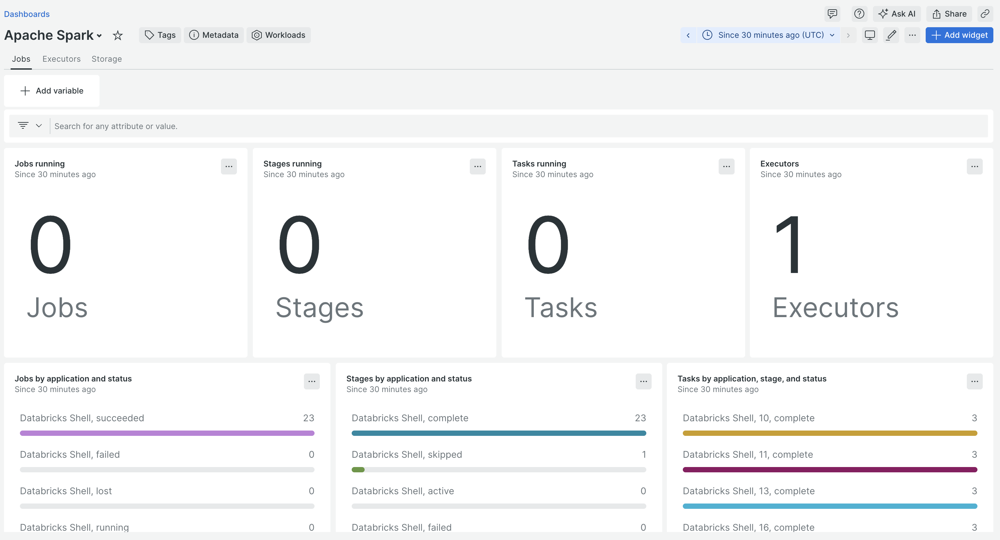
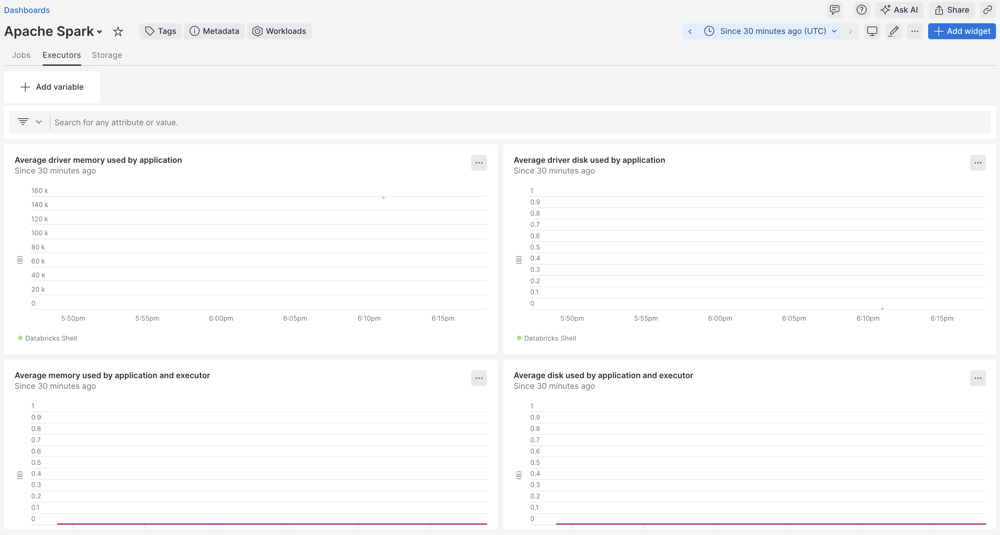
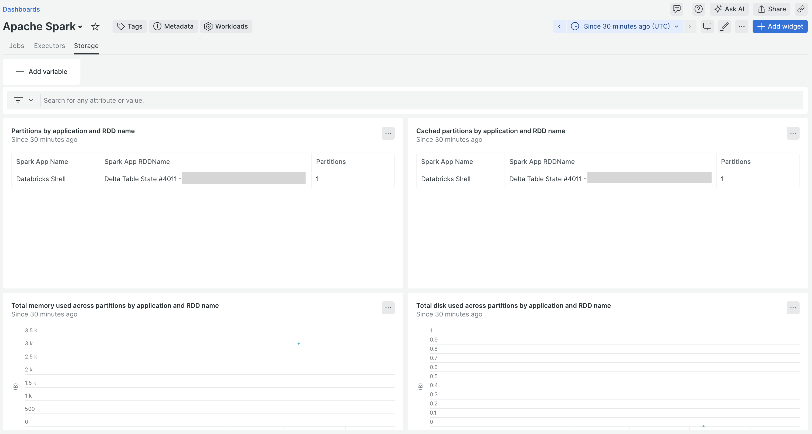
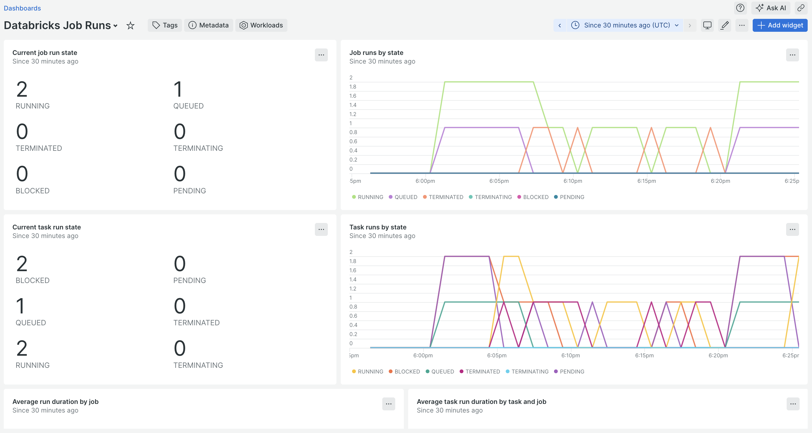
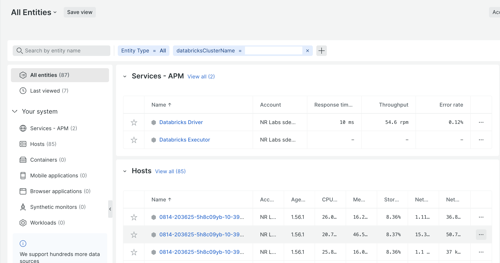

<a href="https://opensource.newrelic.com/oss-category/#new-relic-experimental"><picture><source media="(prefers-color-scheme: dark)" srcset="https://github.com/newrelic/opensource-website/raw/main/src/images/categories/dark/Experimental.png"><source media="(prefers-color-scheme: light)" srcset="https://github.com/newrelic/opensource-website/raw/main/src/images/categories/Experimental.png"></picture></a>


# New Relic Databricks Integration

This integration collects telemetry from Databricks (including Spark on
Databricks) and/or Spark telemetry from any Spark deployment. See the
[Features](#features) section for supported telemetry types.



## Table of Contents

* [Important Notes](#important-notes)
* [Getting Started](#getting-started)
   * [On-host Deployment](#on-host)
* [Features](#features)
* [Usage](#usage)
   * [Command Line Options](#command-line-options)
   * [Configuration](#configuration)
      * [General configuration](#general-configuration)
      * [Pipeline configuration](#pipeline-configuration)
      * [Log configuration](#log-configuration)
      * [Databricks configuration](#databricks-configuration)
      * [Spark configuration](#spark-configuration)
   * [Authentication](#authentication)
   * [Apache Spark Data](#apache-spark-data)
   * [Consumption & Cost Data](#consumption--cost-data)
   * [Job Run Data](#job-run-data)
   * [Pipeline Event Logs](#pipeline-event-logs)
* [Building](#building)
   * [Coding Conventions](#coding-conventions)
   * [Local Development](#local-development)
   * [Releases](#releases)
   * [Github Workflows](#github-workflows)
* [Appendix](#appendix)
   * [Monitoring Cluster Health](#monitoring-cluster-health)

## Important Notes

* All references within this document to Databricks documentation reference the
  [Databricks on AWS documentation](https://docs.databricks.com/en/index.html).
  Use the cloud switcher menu located in the upper right hand corner of the
  documentation to select corresponding documentation for a different cloud.
* [On-host deployment](#on-host) is currently the only supported deployment
  type. For Databricks and non-Databricks Spark deployments, the integration can
  be deployed on [any supported host platform](#deploy-the-integration-on-a-host).
  For Databricks, support is also provided to deploy the integration
  on the [driver node of a Databricks cluster](#deploy-the-integration-on-the-driver-node-of-a-databricks-cluster)
  using a [cluster-scoped init script](https://docs.databricks.com/en/init-scripts/cluster-scoped.html).

## Getting Started

To get started with the New Relic Databricks integration,
[deploy the integration](#on-host) using a supported deployment type,
[configure](#configuration) the integration using supported configuration
mechanisms, and then [import](https://docs.newrelic.com/docs/query-your-data/explore-query-data/dashboards/dashboards-charts-import-export-data/#import-json)
the [sample dashboard](./examples/spark-dashboard.json).

### On-host

The New Relic Databricks integration can be run on any supported host platform.
The integration will collect Databricks telemetry (including Spark on
Databricks) via the [Databricks ReST API](https://docs.databricks.com/api/workspace/introduction)
using the [Databricks SDK for Go](https://docs.databricks.com/en/dev-tools/sdk-go.html)
and/or Spark telemetry from a non-Databricks Spark deployment via the
[Spark ReST API](https://spark.apache.org/docs/3.5.2/monitoring.html#rest-api).

The New Relic Databricks integration can also be deployed on the driver node of
a Databricks [cluster](https://docs.databricks.com/en/getting-started/concepts.html#cluster)
using the provided [init script](./init/cluster_init_integration.sh) to install
and configure the integration at cluster startup time.

#### Deploy the integration on a host

The New Relic Databricks integration provides binaries for the following
host platforms.

* Linux amd64
* Windows amd64

To run the Databricks integration on a host, perform the following steps.

1. Download the appropriate archive for your platform from the [latest release](https://github.com/newrelic-experimental/newrelic-databricks-integration/releases).
1. Extract the archive to a new or existing directory.
1. Create a directory named `configs` in the same directory.
1. Create a file named `config.yml` in the `configs` directory and copy the
   contents of the file [`configs/config.template.yml`](./configs/config.template.yml)
   in this repository into it.
1. Edit the `config.yml` file to [configure](#configuration) the integration
   appropriately for your environment.
1. From the directory where the archive was extracted, execute the integration
   binary using the command `./newrelic-databricks-integration` (or
   `.\newrelic-databricks-integration.exe` on Windows) with the appropriate
   [Command Line Options](#command-line-options).

#### Deploy the integration on the driver node of a Databricks cluster

The New Relic Databricks integration can be deployed on the driver node of a
Databricks [cluster](https://docs.databricks.com/en/getting-started/concepts.html#cluster)
using a [cluster-scoped init script](https://docs.databricks.com/en/init-scripts/cluster-scoped.html).
The [init script](./init/cluster_init_integration.sh) uses custom
[environment variables](https://docs.databricks.com/en/compute/configure.html#env-var)
to specify configuration parameters necessary for the integration [configuration](#configuration).

To install the [init script](./init/cluster_init_integration.sh), perform the
following steps.

1. Login to your Databricks account and navigate to the desired
   [workspace](https://docs.databricks.com/en/getting-started/concepts.html#accounts-and-workspaces).
1. Follow the [recommendations for init scripts](https://docs.databricks.com/en/init-scripts/index.html#recommendations-for-init-scripts)
   to store the [`cluster_init_integration.sh`](./init/cluster_init_integration.sh)
   script within your workspace in the recommended manner. For example, if your
   workspace is [enabled for Unity Catalog](https://docs.databricks.com/en/data-governance/unity-catalog/get-started.html#step-1-confirm-that-your-workspace-is-enabled-for-unity-catalog),
   you should store the init script in a [Unity Catalog volume](https://docs.databricks.com/en/ingestion/file-upload/upload-to-volume.html).
1. Navigate to the [`Compute`](https://docs.databricks.com/en/compute/clusters-manage.html#view-compute)
   tab and select the desired all-purpose or job compute to open the compute
   details UI.
1. Click the button labeled `Edit` to [edit the compute's configuration](https://docs.databricks.com/en/compute/clusters-manage.html#edit-a-compute).
1. Follow the steps to [use the UI to configure a cluster-scoped init script](https://docs.databricks.com/en/init-scripts/cluster-scoped.html#configure-a-cluster-scoped-init-script-using-the-ui)
   and point to the location where you stored the init script in step 2 above.
1. If your cluster is not running, click on the button labeled `Confirm` to
   save your changes. Then, restart the cluster. If your cluster is already
   running, click on the button labeled `Confirm and restart` to save your
   changes and restart the cluster.

Additionally, follow the steps to [set environment variables](https://docs.databricks.com/en/compute/configure.html#environment-variables)
to add the following environment variables.

* `NEW_RELIC_API_KEY` - Your [New Relic User API Key](https://docs.newrelic.com/docs/apis/intro-apis/new-relic-api-keys/#user-key)
* `NEW_RELIC_LICENSE_KEY` - Your [New Relic License Key](https://docs.newrelic.com/docs/apis/intro-apis/new-relic-api-keys/#license-key)
* `NEW_RELIC_ACCOUNT_ID` - Your [New Relic Account ID](https://docs.newrelic.com/docs/accounts/accounts-billing/account-structure/account-id/)
* `NEW_RELIC_REGION` - The [region](https://docs.newrelic.com/docs/accounts/accounts-billing/account-setup/choose-your-data-center/#regions-availability)
   of your New Relic account; one of `US` or `EU`
* `NEW_RELIC_DATABRICKS_WORKSPACE_HOST` - The [instance name](https://docs.databricks.com/en/workspace/workspace-details.html#workspace-instance-names-urls-and-ids)
   of the target Databricks instance
* `NEW_RELIC_DATABRICKS_ACCESS_TOKEN` - To [authenticate](#authentication) with
   a [personal access token](https://docs.databricks.com/en/dev-tools/auth/pat.html#databricks-personal-access-tokens-for-workspace-users),
   your personal access token
* `NEW_RELIC_DATABRICKS_OAUTH_CLIENT_ID` - To [use a service principal to authenticate with Databricks (OAuth M2M)](https://docs.databricks.com/en/dev-tools/auth/oauth-m2m.html),
   the OAuth client ID for the service principal
* `NEW_RELIC_DATABRICKS_OAUTH_CLIENT_SECRET` - To [use a service principal to authenticate with Databricks (OAuth M2M)](https://docs.databricks.com/en/dev-tools/auth/oauth-m2m.html),
   an OAuth client secret associated with the service principal
* `NEW_RELIC_DATABRICKS_USAGE_ENABLED` - Set to `true` to enable collection of
  [consumption and cost data](#consumption--cost-data) from this cluster node or
  `false` to disable collection. Defaults to `true`.
* `NEW_RELIC_DATABRICKS_SQL_WAREHOUSE` - The ID of a [SQL warehouse](https://docs.databricks.com/en/compute/sql-warehouse/index.html)
   where usage queries should be run
* `NEW_RELIC_DATABRICKS_JOB_RUNS_ENABLED` - Set to `true` to enable collection
  of [job run data](#job-run-data) from this cluster node or `false` to disable
  collection. Defaults to `true`.
* `NEW_RELIC_DATABRICKS_PIPELINE_EVENT_LOGS_ENABLED` - Set to `true` to enable
  collection of Databricks Delta Live Tables [pipeline event logs](#pipeline-event-logs)
  from this cluster node or `false` to disable collection. Defaults to `true`.

Note that the `NEW_RELIC_API_KEY` and `NEW_RELIC_ACCOUNT_ID` are currently
unused but are required by the [new-relic-client-go](https://github.com/newrelic/newrelic-client-go)
module used by the integration. Additionally, note that only the personal access
token _or_ OAuth credentials need to be specified but not both. If both are
specified, the OAuth credentials take precedence. Finally, make sure to restart
the cluster following the configuration of the environment variables.

## Features

The New Relic Databricks integration supports the following capabilities.

* Collect Spark telemetry

  The New Relic Databricks integration can collect telemetry from Spark running
  on Databricks. By default, the integration will automatically connect to
  and collect telemetry from the Spark deployments in all clusters created via
  the UI or API in the specified workspace.

  The New Relic Databricks integration can also collect Spark telemetry from any
  non-Databricks Spark deployment.

* Collect Databricks consumption and cost data

  The New Relic Databricks integration can collect consumption and cost related
  data from the Databricks [system tables](https://docs.databricks.com/en/admin/system-tables/index.html).
  This data can be used to show Databricks DBU consumption metrics and estimated
  Databricks costs directly within New Relic.

* Collect Databricks job run telemetry

  The New Relic Databricks integration can collect telemetry about
  [Databricks Job](https://docs.databricks.com/en/jobs/index.html#what-are-databricks-jobs)
  runs, such as job run durations, task run durations, the current state of job
  and task runs, if a job or a task is a retry, and the number of times a task
  was retried.

* Collect Databricks Delta Live Tables Pipeline event logs

  The New Relic Databricks integration can collect [Databricks Delta Live Tables Pipeline event logs](https://docs.databricks.com/en/delta-live-tables/observability.html#event-log)
  for all [Databricks Delta Live Tables Pipelines](https://docs.databricks.com/en/delta-live-tables/develop-pipelines.html)
  defined in a [workspace](https://docs.databricks.com/en/getting-started/concepts.html#accounts-and-workspaces).
  [Databricks Delta Live Tables Pipeline event log](https://docs.databricks.com/en/delta-live-tables/observability.html#event-log)
  entries for every [pipeline update](https://docs.databricks.com/en/delta-live-tables/updates.html)
  are collected and sent to [New Relic Logs](https://docs.newrelic.com/docs/logs/get-started/get-started-log-management/).

## Usage

### Command Line Options

| Option | Description | Default |
| --- | --- | --- |
| --config_path | path to the (#configyml) to use | `configs/config.yml` |
| --dry_run | flag to enable "dry run" mode | `false` |
| --env_prefix | prefix to use for environment variable lookup | `''` |
| --verbose | flag to enable "verbose" mode | `false` |
| --version | display version information only | N/a |

### Configuration

The Databricks integration is configured using the [`config.yml`](#configyml)
and/or environment variables. For Databricks, authentication related configuration
parameters may also be set in a [Databricks configuration profile](https://docs.databricks.com/en/dev-tools/auth/config-profiles.html).
In all cases, where applicable, environment variables always take precedence.

#### `config.yml`

All configuration parameters for the Databricks integration can be set using a
YAML file named [`config.yml`](#configyml). The default location for this file
is `configs/config.yml` relative to the current working directory when the
integration binary is executed. The supported configuration parameters are
listed below. See [`config.template.yml`](./configs/config.template.yml)
for a full configuration example.

##### General configuration

The parameters in this section are configured at the top level of the
[`config.yml`](#configyml).

###### `licenseKey`

| Description | Valid Values | Required | Default |
| --- | --- | --- | --- |
| New Relic license key | string | Y | N/a |

This parameter specifies the New Relic License Key (INGEST) that should be used
to send generated metrics.

The license key can also be specified using the `NEW_RELIC_LICENSE_KEY`
environment variable.

###### `region`

| Description | Valid Values | Required | Default |
| --- | --- | --- | --- |
| New Relic region identifier | `US` / `EU` | N | `US` |

This parameter specifies which New Relic region that generated metrics should be
sent to.

###### `interval`

| Description | Valid Values | Required | Default |
| --- | --- | --- | --- |
| Polling interval (in _seconds_) | numeric | N | 60 |

This parameter specifies the interval (in _seconds_) at which the integration
should poll for data.

This parameter is only used when [`runAsService`](#runasservice) is set to
`true`.

###### `runAsService`

| Description | Valid Values | Required | Default |
| --- | --- | --- | --- |
| Flag to enable running the integration as a "service" | `true` / `false` | N | `false` |

The integration can run either as a "service" or as a simple command line
utility which runs once and exits when it is complete.

When set to `true`, the integration process will run continuously and poll the
for data at the recurring interval specified by the [`interval`](#interval)
parameter. The process will only exit if it is explicitly stopped or a fatal
error or panic occurs.

When set to `false`, the integration will run once and exit. This is intended for
use with an external scheduling mechanism like [cron](https://man7.org/linux/man-pages/man8/cron.8.html).

###### `pipeline`

| Description | Valid Values | Required | Default |
| --- | --- | --- | --- |
| The root node for the set of [pipeline configuration](#pipeline-configuration) parameters | YAML Mapping | N | N/a |

The integration retrieves, processes, and exports data to New Relic using
a data pipeline consisting of one or more receivers, a processing chain, and a
New Relic exporter. Various aspects of the pipeline are configurable. This
element groups together the configuration parameters related to
[pipeline configuration](#pipeline-configuration).

###### `log`

| Description | Valid Values | Required | Default |
| --- | --- | --- | --- |
| The root node for the set of [log configuration](#log-configuration) parameters | YAML Mapping | N | N/a |

The integration uses the [logrus](https://pkg.go.dev/github.com/sirupsen/logrus)
package for application logging. This element groups together the configuration
parameters related to [log configuration](#log-configuration).

###### `mode`

| Description | Valid Values | Required | Default |
| --- | --- | --- | --- |
| The integration execution mode | `databricks` | N | `databricks` |

The integration execution mode. Currently, the only supported execution mode is
`databricks`.

**Deprecated:** As of v2.3.0, this configuration parameter is no longer used.
The presence (or not) of the [`databricks`](#databricks) top-level node will be
used to enable (or disable) the Databricks collector. Likewise, the presence
(or not) of the [`spark`](#spark) top-level node will be used to enable (or
disable) the Spark collector separate from Databricks.

###### `databricks`

| Description | Valid Values | Required | Default |
| --- | --- | --- | --- |
| The root node for the set of [Databricks configuration](#databricks-configuration) parameters | YAML Mapping | N | N/a |

This element groups together the configuration parameters to [configure](#databricks-configuration)
the Databricks collector. If this element is not specified, the Databricks
collector will not be run.

Note that this node is not required. It can be used with or without the
[`spark`](#spark) top-level node.

###### `spark`

| Description | Valid Values | Required | Default |
| --- | --- | --- | --- |
| The root node for the set of [Spark configuration](#spark-configuration) parameters | YAML Mapping | N | N/a |

This element groups together the configuration parameters to [configure](#spark-configuration)
the Spark collector. If this element is not specified, the Spark collector will
not be run.

Note that this node is not required. It can be used with or without the
[`databricks`](#databricks) top-level node.

###### `tags`

| Description | Valid Values | Required | Default |
| --- | --- | --- | --- |
| The root node for a set of custom [tags](https://docs.newrelic.com/docs/new-relic-solutions/new-relic-one/core-concepts/use-tags-help-organize-find-your-data/) to add to all telemetry sent to New Relic | YAML Mapping | N | N/a |

This element specifies a group of custom [tags](https://docs.newrelic.com/docs/new-relic-solutions/new-relic-one/core-concepts/use-tags-help-organize-find-your-data/)
that will be added to all telemetry sent to New Relic. The tags are specified as
a set of key-value pairs.

##### Pipeline configuration

###### `receiveBufferSize`

| Description | Valid Values | Required | Default |
| --- | --- | --- | --- |
| Size of the buffer that holds items before processing | number | N | 500 |

This parameter specifies the size of the buffer that holds received items before
being flushed through the processing chain and on to the exporters. When this
size is reached, the items in the buffer will be flushed automatically.

###### `harvestInterval`

| Description | Valid Values | Required | Default |
| --- | --- | --- | --- |
| Harvest interval (in _seconds_) | number | N | 60 |

This parameter specifies the interval (in _seconds_) at which the pipeline
should automatically flush received items through the processing chain and on
to the exporters. Each time this interval is reached, the pipeline will flush
items even if the item buffer has not reached the size specified by the
[`receiveBufferSize`](#receiveBufferSize) parameter.

###### `instances`

| Description | Valid Values | Required | Default |
| --- | --- | --- | --- |
| Number of concurrent pipeline instances to run | number | N | 3 |

The integration retrieves, processes, and exports metrics to New Relic using
a data pipeline consisting of one or more receivers, a processing chain, and a
New Relic exporter. When [`runAsService`](#runasservice) is `true`, the
integration can launch one or more "instances" of this pipeline to receive,
process, and export data concurrently. Each "instance" will be configured with
the same processing chain and exporters and the receivers will be spread across
the available instances in a round-robin fashion.

This parameter specifies the number of pipeline instances to launch.

**NOTE:** When [`runAsService`](#runasservice) is `false`, only a single
pipeline instance is used.

##### Log configuration

###### `level`

| Description | Valid Values | Required | Default |
| --- | --- | --- | --- |
| Log level | `panic` / `fatal` / `error` / `warn` / `info` / `debug` / `trace`  | N | `warn` |

This parameter specifies the maximum severity of log messages to output with
`trace` being the least severe and `panic` being the most severe. For example,
at the default log level (`warn`), all log messages with severities `warn`,
`error`, `fatal`, and `panic` will be output but `info`, `debug`, and `trace`
will not.

###### `fileName`

| Description | Valid Values | Required | Default |
| --- | --- | --- | --- |
| Path to a file where log output will be written | string | N | `stderr` |

This parameter designates a file path where log output should be written. When
no path is specified, log output will be written to the standard error stream
(`stderr`).

##### Databricks configuration

The Databricks configuration parameters are used to configure the Databricks
collector.

###### `workspaceHost`

| Description | Valid Values | Required | Default |
| --- | --- | --- | --- |
| Databricks workspace instance name | string | conditional | N/a |

This parameter specifies the [instance name](https://docs.databricks.com/en/workspace/workspace-details.html#workspace-instance-names-urls-and-ids)
of the target Databricks instance for which data should be collected. This is
used by the integration when constructing the URLs for API calls. Note that the
value of this parameter _must not_ include the `https://` prefix, e.g.
`https://my-databricks-instance-name.cloud.databricks.com`.

This parameter is required when the collection of Spark telemetry for Spark
running on Databricks is [enabled](#databricks-spark-enabled). Note that this
does not apply when the integration is [deployed directly on the driver node](#deploy-the-integration-on-the-driver-node-of-a-databricks-cluster)
via the provided [init script](./init/cluster_init_integration.sh). This
parameter is unused in that scenario.

The workspace host can also be specified using the `DATABRICKS_HOST`
environment variable.

###### `accessToken`

| Description | Valid Values | Required | Default |
| --- | --- | --- | --- |
| Databricks personal access token | string | N | N/a |

When set, the integration will use [Databricks personal access token authentication](https://docs.databricks.com/en/dev-tools/auth/pat.html)
to authenticate Databricks API calls with the value of this parameter as the
Databricks [personal access token](https://docs.databricks.com/en/dev-tools/auth/pat.html#databricks-personal-access-tokens-for-workspace-users).

The personal access token can also be specified using the `DATABRICKS_TOKEN`
environment variable or any other SDK-supported mechanism (e.g. the `token`
field in a Databricks [configuration profile](https://docs.databricks.com/en/dev-tools/auth/config-profiles.html)).

See the [authentication section](#authentication) for more details.

###### `oauthClientId`

| Description | Valid Values | Required | Default |
| --- | --- | --- | --- |
| Databricks OAuth M2M client ID | string | N | N/a |

When set, the integration will [use a service principal to authenticate with Databricks (OAuth M2M)](https://docs.databricks.com/en/dev-tools/auth/oauth-m2m.html)
when making Databricks API calls. The value of this parameter will be used as
the OAuth client ID.

The OAuth client ID can also be specified using the `DATABRICKS_CLIENT_ID`
environment variable or any other SDK-supported mechanism (e.g. the `client_id`
field in a Databricks [configuration profile](https://docs.databricks.com/en/dev-tools/auth/config-profiles.html)).

See the [authentication section](#authentication) for more details.

###### `oauthClientSecret`

| Description | Valid Values | Required | Default |
| --- | --- | --- | --- |
| Databricks OAuth M2M client secret | string | N | N/a |

When the [`oauthClientId`](#oauthclientid) is set, this parameter can be set to
specify the [OAuth secret](https://docs.databricks.com/en/dev-tools/auth/oauth-m2m.html#step-3-create-an-oauth-secret-for-a-service-principal)
associated with the [service principal](https://docs.databricks.com/en/admin/users-groups/service-principals.html#what-is-a-service-principal).

The OAuth client secret can also be specified using the
`DATABRICKS_CLIENT_SECRET` environment variable or any other SDK-supported
mechanism (e.g. the `client_secret` field in a Databricks
[configuration profile](https://docs.databricks.com/en/dev-tools/auth/config-profiles.html)).

See the [authentication section](#authentication) for more details.

###### `sparkMetrics`

| Description | Valid Values | Required | Default |
| --- | --- | --- | --- |
| Flag to enable automatic collection of Spark metrics | `true` / `false` | N | `true` |

**Deprecated** This configuration parameter has been deprecated in favor of the
configuration parameter [`databricks.spark.enabled`](#databricks-spark-enabled).
Use that parameter instead.

###### `sparkMetricPrefix`

| Description | Valid Values | Required | Default |
| --- | --- | --- | --- |
| A prefix to prepend to Spark metric names | string | N | N/a |

**Deprecated** This configuration parameter has been deprecated in favor of the
configuration parameter [`databricks.spark.metricPrefix`](#databricks-spark-metricprefix).
Use that parameter instead.

###### `sparkClusterSources`

| Description | Valid Values | Required | Default |
| --- | --- | --- | --- |
| The root node for the [Databricks cluster source configuration](#databricks-cluster-source-configuration) | YAML Mapping | N | N/a |

**Deprecated** This configuration parameter has been deprecated in favor of the
configuration parameter [`databricks.spark.clusterSources`](#databricks-spark-clustersources).
Use that parameter instead.

###### `sqlStatementTimeout`

| Description | Valid Values | Required | Default |
| --- | --- | --- | --- |
| Timeout (in seconds) to use when executing SQL statements on a SQL warehouse | number | N | 30 |

Certain telemetry and data collected by the Databricks collector requires the
collector to run Databricks SQL statements on a SQL warehouse. This
configuration parameter specifies the number of seconds to wait before timing
out a pending or running SQL query.

###### `spark`

| Description | Valid Values | Required | Default |
| --- | --- | --- | --- |
| The root node for the set of [Databricks Spark configuration](#databricks-spark-configuration) parameters | YAML Mapping | N | N/a |

This element groups together the configuration parameters to [configure](#databricks-spark-configuration)
the Databricks collector settings related to the collection of telemetry from
Databricks running on Spark. The configuration parameters in this group replace
the configuration parameters [`sparkMetrics`](#sparkmetrics),
[`sparkMetricPrefix`](#sparkmetricprefix), and [`sparkClusterSources`](#sparkclustersources).

###### `usage`

| Description | Valid Values | Required | Default |
| --- | --- | --- | --- |
| The root node for the set of [Databricks Usage configuration](#databricks-usage-configuration) parameters | YAML Mapping | N | N/a |

This element groups together the configuration parameters to [configure](#databricks-usage-configuration)
the Databricks collector settings related to the collection of
[consumption and cost data](#consumption--cost-data).

###### `jobs`

| Description | Valid Values | Required | Default |
| --- | --- | --- | --- |
| The root node for the set of [Databricks Job configuration](#databricks-job-configuration) parameters | YAML Mapping | N | N/a |

This element groups together the configuration parameters to [configure](#databricks-job-configuration)
the Databricks collector settings related to the collection of job data.

###### `pipelines`

| Description | Valid Values | Required | Default |
| --- | --- | --- | --- |
| The root node for the set of [Databricks Pipeline configuration](#databricks-pipeline-configuration) parameters | YAML Mapping | N | N/a |

This element groups together the configuration parameters to [configure](#databricks-pipeline-configuration)
the Databricks collector settings related to the collection of [Databricks Delta Live Tables Pipelines](https://docs.databricks.com/en/delta-live-tables/develop-pipelines.html)
telemetry.

##### Databricks `spark` configuration

###### Databricks Spark `enabled`

| Description | Valid Values | Required | Default |
| --- | --- | --- | --- |
| Flag to enable automatic collection of Spark metrics | `true` / `false` | N | `true` |

By default, when the Databricks collector is enabled, it will automatically
collect Spark telemetry from Spark running on Databricks.

This flag can be used to disable the collection of Spark telemetry by the
Databricks collector. This may be useful to control data ingest when business
requirements call for the collection of non-Spark related Databricks telemetry
and Spark telemetry is not used. This flag is also used by the integration when
it is [deployed directly on the driver node of a Databricks cluster](#deploy-the-integration-on-the-driver-node-of-a-databricks-cluster) using the
the provided [init script](./init/cluster_init_integration.sh) since Spark
telemetry is collected by the Spark collector in this scenario.

**NOTE:** This configuration parameter replaces the older [`sparkMetrics`](#sparkmetrics)
configuration parameter.

###### Databricks Spark `metricPrefix`

| Description | Valid Values | Required | Default |
| --- | --- | --- | --- |
| A prefix to prepend to Spark metric names | string | N | N/a |

This parameter serves the same purpose as the [`metricPrefix`](#metricprefix)
parameter of the [Spark configuration](#spark-configuration) except that it
applies to Spark telemetry collected by the Databricks collector. See the
[`metricPrefix`](#metricprefix) parameter of the [Spark configuration](#spark-configuration)
for more details.

Note that this parameter has no effect on Spark telemetry collected by the Spark
collector. This includes the case when the integration is
[deployed directly on the driver node of a Databricks cluster](#deploy-the-integration-on-the-driver-node-of-a-databricks-cluster)
using the the provided [init script](./init/cluster_init_integration.sh)
since Spark telemetry is collected by the Spark collector in this scenario.

**NOTE:** This configuration parameter replaces the older [`sparkMetricPrefix`](#sparkmetricprefix)
configuration parameter.

###### Databricks Spark `clusterSources`

| Description | Valid Values | Required | Default |
| --- | --- | --- | --- |
| The root node for the [Databricks cluster source configuration](#databricks-cluster-source-configuration) | YAML Mapping | N | N/a |

The mechanism used to create a cluster is referred to as a cluster "source". The
Databricks collector supports collecting Spark telemetry from all-purpose
clusters created via the UI or API and from job clusters created via the
Databricks Jobs Scheduler. This element groups together the flags used to
individually [enable or disable](#databricks-cluster-source-configuration) the
cluster sources from which the Databricks collector will collect Spark
telemetry.

**NOTE:** This configuration parameter replaces the older [`sparkClusterSources`](#sparkclustersources)
configuration parameter.

##### Databricks cluster source configuration

###### `ui`

| Description | Valid Values | Required | Default |
| --- | --- | --- | --- |
| Flag to enable automatic collection of Spark telemetry from all-purpose clusters created via the UI | `true` / `false` | N | `true` |

By default, when the Databricks collector is enabled, it will automatically
collect Spark telemetry from all all-purpose clusters created via the UI.

This flag can be used to disable the collection of Spark telemetry from
all-purpose clusters created via the UI.

###### `job`

| Description | Valid Values | Required | Default |
| --- | --- | --- | --- |
| Flag to enable automatic collection of Spark telemetry from job clusters created via the Databricks Jobs Scheduler | `true` / `false` | N | `true` |

By default, when the Databricks collector is enabled, it will automatically
collect Spark telemetry from job clusters created by the Databricks Jobs
Scheduler.

This flag can be used to disable the collection of Spark telemetry from job
clusters created via the Databricks Jobs Scheduler.

###### `api`

| Description | Valid Values | Required | Default |
| --- | --- | --- | --- |
| Flag to enable automatic collection of Spark telemetry from all-purpose clusters created via the [Databricks ReST API](https://docs.databricks.com/api/workspace/introduction) | `true` / `false` | N | `true` |

By default, when the Databricks collector is enabled, it will automatically
collect Spark telemetry from all-purpose clusters created via the [Databricks ReST API](https://docs.databricks.com/api/workspace/introduction).

This flag can be used to disable the collection of Spark telemetry from
all-purpose clusters created via the [Databricks ReST API](https://docs.databricks.com/api/workspace/introduction).

##### Databricks Usage Configuration

The Databricks usage configuration parameters are used to configure Databricks
collector settings related to the collection of Databricks
[consumption and cost data](#consumption--cost-data).

###### Databricks Usage `enabled`

| Description | Valid Values | Required | Default |
| --- | --- | --- | --- |
| Flag to enable automatic collection of consumption and cost data | `true` / `false` | N | `true` |

By default, when the Databricks collector is enabled, it will automatically
collect [consumption and cost data](#consumption--cost-data).

This flag can be used to disable the collection of consumption and cost data by
the Databricks collector. This may be useful when running multiple instances of
the New Relic Databricks integration. In this scenario, Databricks consumption
and cost data collection should _only_ be enabled on a single instance.
Otherwise, this data will be recorded more than once in New Relic, affecting
consumption and cost calculations.

###### `warehouseId`

| Description | Valid Values | Required | Default |
| --- | --- | --- | --- |
| ID of a SQL warehouse on which to run usage-related SQL statements | string | Y | N/a |

The ID of a SQL warehouse on which to run the SQL statements used to collect
Databricks [consumption and cost data](#consumption--cost-data).

This parameter is required when the collection of Databricks
[consumption and cost data](#consumption--cost-data) is [enabled](#databricks-usage-enabled).

###### `includeIdentityMetadata`

| Description | Valid Values | Required | Default |
| --- | --- | --- | --- |
| Flag to enable inclusion of identity related metadata in consumption and cost data | `true` / `false` | N | `false` |

When the collection of Databricks [consumption and cost data](#consumption--cost-data)
is [enabled](#databricks-usage-enabled), the Databricks collector can include
several pieces of identifying information along with the consumption and cost
data.

By default, when the collection of Databricks [consumption and cost data](#consumption--cost-data)
is [enabled](#databricks-usage-enabled), the Databricks collector will _not_
collect such data as it may be personally identifiable. This flag can be used to
enable the inclusion of the identifying information.

When enabled, the following values are included.

* The identity of the user a serverless billing record is attributed to. This
  value is included in the [identity metadata](https://docs.databricks.com/en/admin/system-tables/billing.html#analyze-identity-metadata)
  returned from usage records in the [billable usage system table](https://docs.databricks.com/en/admin/system-tables/billing.html).
* The identity of the cluster creator for each usage record for billable usage
  attributed to all-purpose and job compute.
* The single user name for each usage record for billable usage attributed to
  all-purpose and job compute configured for [single-user access mode](https://docs.databricks.com/en/compute/configure.html#access-mode).
* The identity of the warehouse creator for each usage record for billable usage
  attributed to SQL warehouse compute.
* The identity of the user or service principal used to run jobs for each query
  result collected by [job cost data](#job-costs) queries.

###### `runTime`

| Description | Valid Values | Required | Default |
| --- | --- | --- | --- |
| Time of day (as `HH:mm:ss`) at which to run usage data collection | string with format `HH:mm:ss` | N | `02:00:00` |

This parameter specifies the time of day at which the collection of
[consumption and cost data](#consumption--cost-data) occur. The value must be of
the form `HH:mm:ss` where `HH` is the `0`-padded 24-hour clock hour
(`00` - `23`), `mm` is the `0`-padded minute (`00` - `59`) and `ss` is the
`0`-padded second (`00` - `59`). For example, `09:00:00` is the time 9:00 AM and
`23:30:00` is the time 11:30 PM.

The time will _always_ be interpreted according to the UTC time zone. The time
zone can not be configured. For example, to specify that the integration should
be run at 2:00 AM EST (-0500), the value `07:00:00` should be specified.

###### `optionalQueries`

| Description | Valid Values | Required | Default |
| --- | --- | --- | --- |
| The root node for the set of flags used to selectively enable or disable optional usage queries | YAML Mapping | N | N/a |

When the collection of Databricks [consumption and cost data](#consumption--cost-data)
is [enabled](#databricks-usage-enabled), the Databricks collector will always
collect [billable usage data](#billable-usage-data) and [list pricing data](#list-pricing-data)
on every run. In addition, by default, the Databricks collector will also run
all [job cost](#job-costs) queries on every run. However, the latter behavior
can be configured using a set of flags specified with this configuration
property to selectively enable or disable the [job cost](#job-costs) queries.
Each flag is specified using a property with the query ID as the name of the
property and `true` or `false` as the value of the property.The following flags
are supported.

* [`jobs_cost_list_cost_per_job_run`](#list-cost-per-job-run)
* [`jobs_cost_list_cost_per_job`](#list-cost-per-job)
* [`jobs_cost_frequent_failures`](#list-cost-of-failed-job-runs-for-jobs-with-frequent-failures)
* [`jobs_cost_most_retries`](#list-cost-of-repaired-job-runs-for-jobs-with-frequent-repairs)

For example, to enable the [list cost per job run](#list-cost-per-job-run) query
and the [list cost per job](#list-cost-per-job) query but disable the
[list cost of failed job runs for jobs with frequent failures](#list-cost-of-failed-job-runs-for-jobs-with-frequent-failures) query
and the [list cost of repaired job runs for jobs with frequent repairs](#list-cost-of-repaired-job-runs-for-jobs-with-frequent-repairs) query,
the following configuration would be specified.

```yaml
  optionalQueries:
    jobs_cost_list_cost_per_job_run: true
    jobs_cost_list_cost_per_job: true
    jobs_cost_frequent_failures: false
    jobs_cost_most_retries: false
```

##### Databricks Job configuration

###### `runs`

| Description | Valid Values | Required | Default |
| --- | --- | --- | --- |
| The root node for the set of [Databricks Job Run configuration](#databricks-job-run-configuration) parameters | YAML Mapping | N | N/a |

This element groups together the configuration parameters to [configure](#databricks-job-run-configuration)
the Databricks collector settings related to the collection of [job run data](#job-run-data).

##### Databricks job run configuration

The Databricks job run configuration parameters are used to configure Databricks
collector settings related to the collection of Databricks [job run data](#job-run-data).

###### Databricks job runs `enabled`

| Description | Valid Values | Required | Default |
| --- | --- | --- | --- |
| Flag to enable automatic collection of job run data | `true` / `false` | N | `true` |

By default, when the Databricks collector is enabled, it will automatically
collect [job run data](#job-run-data).

This flag can be used to disable the collection of job run data by the
Databricks collector. This may be useful when running multiple instances of the
New Relic Databricks integration against the same Databricks
[workspace](https://docs.databricks.com/en/getting-started/concepts.html#accounts-and-workspaces).
In this scenario, Databricks job run data collection should _only_ be enabled on
a single instance of the integration. Otherwise, this data will be recorded more
than once in New Relic, affecting product features that use [job run metrics](#job-run-metrics)
(e.g. [dashboards](https://docs.newrelic.com/docs/query-your-data/explore-query-data/dashboards/introduction-dashboards/)
and [alerts](https://docs.newrelic.com/docs/alerts/overview/)).

###### Databricks job run `metricPrefix`

| Description | Valid Values | Required | Default |
| --- | --- | --- | --- |
| A prefix to prepend to Databricks [job run metric](#job-run-metrics) names | string | N | N/a |

This parameter specifies a prefix that will be prepended to each Databricks
[job run metric](#job-run-metrics) name when the metric is exported to New
Relic.

For example, if this parameter is set to `databricks.`, then the full name of
the metric representing the duration of a job run (`job.run.duration`) will be
`databricks.job.run.duration`.

Note that it is not recommended to leave this value empty as the metric names
without a prefix may be ambiguous.

###### Databricks job run `includeRunId`

| Description | Valid Values | Required | Default |
| --- | --- | --- | --- |
| Flag to enable inclusion of the job run ID in the `databricksJobRunId` attribute on all [job run metrics](#job-run-metrics) | `true` / `false` | N | `false` |

By default, the Databricks collector will not include job run IDs on any of the
[job run metrics](#job-run-metrics) in order to avoid possible violations of
[metric cardinality limits](https://docs.newrelic.com/docs/data-apis/convert-to-metrics/creating-metric-rules-requirements-tips/#attributes-limit)
due to the fact that job run IDs have high cardinality because they are unique
across all jobs and job runs.

This flag can be used to enable the inclusion of the job run ID in the
`databricksJobRunId` attribute on all job metrics.

When enabled, use the [Limits UI](https://docs.newrelic.com/docs/data-apis/manage-data/view-system-limits/#limits-ui)
and/or create a [dashboard](https://docs.newrelic.com/docs/data-apis/manage-data/query-limits/#create-a-dashboard-to-view-your-limit-status)
in order to monitor your limit status. Additionally, [set alerts on resource metrics](https://docs.newrelic.com/docs/data-apis/manage-data/query-limits/#set-alerts-on-resource-metrics)
to provide updates on limits changes.

###### `startOffset`

| Description | Valid Values | Required | Default |
| --- | --- | --- | --- |
| Offset (in seconds) from the current time to use for calculating the earliest job run start time to match when listing job runs | number | N | 86400 (1 day) |

This parameter specifies an offset, in seconds that can be used to tune the
collector's performance by limiting the number of job runs to return by
constraining the start time of job runs to match to be greather than a
particular time in the past calculated as an offset from the current time.

See the section [`startOffset` Configuration](#startoffset-configuration) for
more details.

##### Databricks Pipeline configuration

###### `logs`

| Description | Valid Values | Required | Default |
| --- | --- | --- | --- |
| The root node for the set of [Databricks Pipeline Event Logs configuration](#databricks-pipeline-event-logs-configuration) parameters | YAML Mapping | N | N/a |

This element groups together the configuration parameters to [configure](#databricks-pipeline-event-logs-configuration)
the Databricks collector settings related to the collection of Databricks Delta
Live Tables [pipeline event logs](#pipeline-event-logs).

##### Databricks pipeline event logs configuration

The Databricks pipeline event logs configuration parameters are used to
configure Databricks collector settings related to the collection of Databricks
Delta Live Tables [pipeline event logs](#pipeline-event-logs).

###### Databricks pipeline event logs `enabled`

| Description | Valid Values | Required | Default |
| --- | --- | --- | --- |
| Flag to enable automatic collection of Databricks Delta Live Tables [pipeline event logs](#pipeline-event-logs) | `true` / `false` | N | `true` |

By default, when the Databricks collector is enabled, it will automatically
collect Databricks Delta Live Tables [pipeline event logs](#pipeline-event-logs).

This flag can be used to disable the collection of Databricks Delta Live Tables
[pipeline event logs](#pipeline-event-logs) by the Databricks collector. This
may be useful when running multiple instances of the New Relic Databricks
integration against the same Databricks [workspace](https://docs.databricks.com/en/getting-started/concepts.html#accounts-and-workspaces).
In this scenario, the collection of Databricks Delta Live Tables [pipeline event logs](#pipeline-event-logs)
should _only_ be enabled on a single instance of the integration. Otherwise,
duplicate New Relic log entries will be created for each Databricks Delta Live
Tables [pipeline event log](#pipeline-event-logs) entry, making troubleshooting
challenging and affecting product features that rely on signal integrity such as
[anomaly detection](https://docs.newrelic.com/docs/alerts/create-alert/set-thresholds/anomaly-detection/).

##### Spark configuration

The Spark configuration parameters are used to configure the Spark collector.

###### `webUiUrl`

| Description | Valid Values | Required | Default |
| --- | --- | --- | --- |
| The [Web UI](https://spark.apache.org/docs/3.5.2/web-ui.html) URL of an application on the Spark deployment to monitor | string | N | N/a |

This parameter can be used to monitor a non-Databricks Spark deployment. It
specifes the URL of the [Web UI](https://spark.apache.org/docs/3.5.2/web-ui.html)
of an application running on the Spark deployment to monitor. The value should
be of the form `http[s]://<hostname>:<port>` where `<hostname>` is the hostname
of the Spark deployment to monitor and `<port>` is the port number of the
Spark application's Web UI (typically 4040 or 4041, 4042, etc if more than one
application is running on the same host).

Note that the value must not contain a path. The path of the [Spark ReST API](https://spark.apache.org/docs/3.5.2/monitoring.html#rest-api)
endpoints (mounted at `/api/v1`) will automatically be prepended.

###### `metricPrefix`

| Description | Valid Values | Required | Default |
| --- | --- | --- | --- |
| A prefix to prepend to Spark metric names | string | N | N/a |

This parameter specifies a prefix that will be prepended to each Spark metric
name when the metric is exported to New Relic.

For example, if this parameter is set to `spark.`, then the full name of the
metric representing the value of the memory used on application executors
(`app.executor.memoryUsed`) will be `spark.app.executor.memoryUsed`.

Note that it is not recommended to leave this value empty as the metric names
without a prefix may be ambiguous. Additionally, note that this parameter has no
effect on Spark telemetry collected by the Databricks collector. In that case,
use the [`sparkMetricPrefix`](#sparkmetricprefix) instead.

### Authentication

The Databricks integration uses the [Databricks SDK for Go](https://docs.databricks.com/en/dev-tools/sdk-go.html)
to access the Databricks and Spark ReST APIs. The SDK performs authentication on
behalf of the integration and provides many options for configuring the
authentication type and credentials to be used. See the
[SDK documentation](https://github.com/databricks/databricks-sdk-go?tab=readme-ov-file#authentication)
and the [Databricks client unified authentication documentation](https://docs.databricks.com/en/dev-tools/auth/unified-auth.html)
for details.

For convenience purposes, the following parameters can be used in the
[Databricks configuration](#databricks-configuration) section of the
[`config.yml](#configyml) file.

- [`accessToken`](#accesstoken) - When set, the integration will instruct the
  SDK to explicitly use [Databricks personal access token authentication](https://docs.databricks.com/en/dev-tools/auth/pat.html).
  The SDK will _not_ attempt to try other authentication mechanisms and instead
  will fail immediately if personal access token authentication fails.
- [`oauthClientId`](#oauthclientid) - When set, the integration will instruct
  the SDK to explicitly [use a service principal to authenticate with Databricks (OAuth M2M)](https://docs.databricks.com/en/dev-tools/auth/oauth-m2m.html).
  The SDK will _not_ attempt to try other authentication mechanisms and instead
  will fail immediately if OAuth M2M authentication fails. The OAuth Client
  secret can be set using the [`oauthClientSecret`](#oauthclientsecret)
  configuration parameter or any of the other mechanisms supported by the SDK
  (e.g. the `client_secret` field in a Databricks [configuration profile](https://docs.databricks.com/en/dev-tools/auth/config-profiles.html)
  or the `DATABRICKS_CLIENT_SECRET` environment variable).
- [`oauthClientSecret`](#oauthclientsecret) - The OAuth client secret to use for
  [OAuth M2M authentication](https://docs.databricks.com/en/dev-tools/auth/oauth-m2m.html).
  This value is _only_ used when [`oauthClientId`](#oauthclientid) is set in the
  [`config.yml`](#configyml). The OAuth client secret can also be set using any
  of the other mechanisms supported by the SDK (e.g. the `client_secret` field
  in a Databricks [configuration profile](https://docs.databricks.com/en/dev-tools/auth/config-profiles.html)
  or the `DATABRICKS_CLIENT_SECRET` environment variable).

### Apache Spark Data

The New Relic Databricks integration can collect [Apache Spark](https://spark.apache.org/docs/latest/index.html)
[application](https://spark.apache.org/docs/latest/submitting-applications.html)
metrics for all running applications in a given [Spark cluster](https://spark.apache.org/docs/3.5.4/cluster-overview.html).
Metrics are collected by accessing the monitoring [ReST API](https://spark.apache.org/docs/latest/monitoring.html#rest-api)
through the [Web UI](https://spark.apache.org/docs/latest/web-ui.html) of a
given [`SparkContext`](https://spark.apache.org/docs/3.5.4/rdd-programming-guide.html#initializing-spark).

This feature can be used for _any_ [Spark cluster](https://spark.apache.org/docs/3.5.4/cluster-overview.html),
not just for Spark running on Databricks. The following logic is used to
determine when application metrics are collected and from what sources.

* When the Databricks collector is enabled (the top-level [`databricks`](#databricks)
  node is specified) and the [Databricks Spark `enabled`](#databricks-spark-enabled)
  flag is not specified or is set to `true`, Spark application metrics are
  collected from the following sources.

  * All _running_ all-purpose [clusters](https://docs.databricks.com/en/getting-started/concepts.html#cluster)
    created through the UI, unless the [`ui`](#ui) [cluster source](#databricks-spark-clustersources)
    flag is set to `false`
  * All _running_ all-purpose [clusters](https://docs.databricks.com/en/getting-started/concepts.html#cluster)
    created through an API request, unless the [`api`](#api) [cluster source](#databricks-spark-clustersources)
    flag is set to `false`
  * All _running_ job [clusters](https://docs.databricks.com/en/getting-started/concepts.html#cluster)
    created by the Databricks Job Scheduler, unless the [`job`](#job)
    [cluster source](#databricks-spark-clustersources) flag is set to `false`

* When the Spark collector is enabled (the top-level [`spark`](#spark) node is
  specified), Spark application metrics are collected from the [Web UI](https://spark.apache.org/docs/latest/web-ui.html)
  URL specified in the [`webUiUrl`](#webuiurl) or from the [Web UI](https://spark.apache.org/docs/latest/web-ui.html)
  URL `https://localhost:4040` by default.

#### Spark Application Metric Data

Spark application telemetry is sent to New Relic as [dimensional metrics](https://docs.newrelic.com/docs/data-apis/understand-data/new-relic-data-types/#dimensional-metrics).
The provided metrics and attributes (dimensions) are listed in the sections
below.

**NOTE:** Many of the descriptions below are sourced from the
Apache Spark monitoring [ReST API documentation](https://spark.apache.org/docs/latest/monitoring.html#rest-api).

##### Spark application metric types

The Apache Spark monitoring [ReST API](https://spark.apache.org/docs/latest/monitoring.html#rest-api)
returns two types of metrics: monotonically increasing counters (referred to
below simply as "counters") and gauges, with the majority of metrics being
counters.

While all gauge metrics returned from the [ReST API](https://spark.apache.org/docs/latest/monitoring.html#rest-api)
are created as gauge metrics within New Relic, note that all counter metrics
returned from the [ReST API](https://spark.apache.org/docs/latest/monitoring.html#rest-api)
are also created as gauge metrics. While the `latest()`, `min()`, `max()`,
`sum()`, `count()`, and `average()` [NRQL aggregator functions](https://docs.newrelic.com/docs/nrql/nrql-syntax-clauses-functions/#aggregator-functions)
are all therefore available for use with these metrics, only [`latest()`](https://docs.newrelic.com/docs/nrql/nrql-syntax-clauses-functions/#latest)
will provide meaningful results (e.g. taking the average of a set of data points
that represent a monotonically increasing counter makes no sense).

Therefore, in general, only the [`latest()`](https://docs.newrelic.com/docs/nrql/nrql-syntax-clauses-functions/#latest)
aggregator function should be used when visualizing or alerting on metrics
listed in the sections below with the metric type `counter`.

Further to this, even when using the [`latest()`](https://docs.newrelic.com/docs/nrql/nrql-syntax-clauses-functions/#latest)
aggregator function, the metrics have no meaning without an identifying `FACET`.

As an example, to show the total number of completed tasks by executor ID, use
the query `SELECT latest(app.executor.completedTasks) FROM Metric FACET sparkAppName, sparkAppExecutorId`
and not `SELECT count(app.executor.completedTasks) FROM Metric FACET sparkAppName, sparkAppExecutorId`.
Using `count()` on a gauge metric accesses the `count` field of the metric which
in this case is always `1` even though the metric being represented is a
counter. The counter value is actually in the `latest` field of the metric.
Further, using the metric _without_ faceting by the executor ID will only return
the latest `app.executor.completedTasks` metric in the selected time window and
ignore any other instances of that metric in the same time window.

##### Common Spark application metric attributes

The following attributes are included on _all_ Spark application metrics.

| Attribute Name | Data Type | Description |
| --- | --- | --- |
| `sparkAppId` | string | Spark application ID |
| `sparkAppName` | string | Spark application name |
| `databricksClusterId` | string | **Databricks only** Databricks cluster ID |
| `databricksClusterName` | string | **Databricks only** Databricks cluster name |

##### Spark application metrics

The following metrics are included for each Spark application.

| Attribute Name | Data Type | Description |
| --- | --- | --- |
| `app.jobs` | string | Spark job [counts](#spark-job-stage-and-task-counts) by job [status](#spark-job-stage-and-task-status) |
| `app.stages` | string | Spark stage [counts](#spark-job-stage-and-task-counts) by stage [status](#spark-job-stage-and-task-status) |

##### Spark application executor metrics

The following metrics are included for each Spark application executor. Metrics
are scoped to a given executor using the `sparkAppExecutorId` [attribute](#spark-application-executor-attributes).

| Metric Name | Metric Type | Description |
| --- | --- | --- |
| `app.executor.rddBlocks` | gauge | RDD blocks in the block manager of this executor |
| `app.executor.memoryUsed` | gauge | Storage memory used by this executor |
| `app.executor.diskUsed` | gauge | Disk space used for RDD storage by this executor |
| `app.executor.totalCores` | counter | Number of cores available in this executor |
| `app.executor.maxTasks` | counter | Maximum number of tasks that can run concurrently in this executor |
| `app.executor.activeTasks` | gauge | Number of tasks currently executing |
| `app.executor.failedTasks` | counter | Number of tasks that have failed in this executor |
| `app.executor.completedTasks` | counter | Number of tasks that have completed in this executor |
| `app.executor.totalTasks` | counter | Total number of tasks (running, failed and completed) in this executor |
| `app.executor.totalDuration` | counter | Elapsed time the JVM spent executing tasks in this executor. The value is expressed in milliseconds. |
| `app.executor.totalGCTime` | counter | Elapsed time the JVM spent in garbage collection summed in this executor. The value is expressed in milliseconds. |
| `app.executor.totalInputBytes` | counter | Total input bytes summed in this executor |
| `app.executor.totalShuffleRead` | counter | Total shuffle read bytes summed in this executor |
| `app.executor.totalShuffleWrite` | counter | Total shuffle write bytes summed in this executor |
| `app.executor.maxMemory` | gauge | Total amount of memory available for storage, in bytes |
| `app.executor.memory.usedOnHeapStorage` | gauge | Used on heap memory currently for storage, in bytes |
| `app.executor.memory.usedOffHeapStorage` | gauge | Used off heap memory currently for storage, in bytes |
| `app.executor.memory.totalOnHeapStorage` | gauge | Total available on heap memory for storage, in bytes. This amount can vary over time, on the MemoryManager implementation. |
| `app.executor.memory.totalOffHeapStorage` | gauge | Total available off heap memory for storage, in bytes. This amount can vary over time, depending on the MemoryManager implementation. |
| `app.executor.memory.peak.jvmHeap` | counter | Peak memory usage of the heap that is used for object allocation by the Java virtual machine |
| `app.executor.memory.peak.jvmOffHeap` | counter | Peak memory usage of non-heap memory that is used by the Java virtual machine |
| `app.executor.memory.peak.onHeapExecution` | counter | Peak on heap execution memory usage, in bytes |
| `app.executor.memory.peak.offHeapExecution` | counter | Peak off heap execution memory usage, in bytes |
| `app.executor.memory.peak.onHeapStorage` | counter | Peak on heap storage memory usage, in bytes |
| `app.executor.memory.peak.offHeapStorage` | counter | Peak off heap storage memory usage, in bytes |
| `app.executor.memory.peak.onHeapUnified` | counter | Peak on heap memory usage (execution and storage) |
| `app.executor.memory.peak.offHeapUnified` | counter | Peak off heap memory usage (execution and storage) |
| `app.executor.memory.peak.directPool` | counter | Peak JVM memory usage for direct buffer pool (java.lang.management.BufferPoolMXBean) |
| `app.executor.memory.peak.mappedPool` | counter | Peak JVM memory usage for mapped buffer pool (java.lang.management.BufferPoolMXBean) |
| `app.executor.memory.peak.nettyDirect` | counter | **Databricks only** |
| `app.executor.memory.peak.jvmDirect` | counter | **Databricks only** |
| `app.executor.memory.peak.sparkDirectMemoryOverLimit` | counter | **Databricks only** |
| `app.executor.memory.peak.totalOffHeap` | counter | **Databricks only** |
| `app.executor.memory.peak.processTreeJvmVirtual` | counter | Peak virtual memory size, in bytes |
| `app.executor.memory.peak.processTreeJvmRSS` | counter | Peak Resident Set Size (number of pages the process has in real memory) |
| `app.executor.memory.peak.processTreePythonVirtual` | counter | Peak virtual memory size for Python, in bytes |
| `app.executor.memory.peak.processTreePythonRSS` | counter | Peak resident Set Size for Python |
| `app.executor.memory.peak.processTreeOtherVirtual` | counter | Peak virtual memory size for other kinds of processes, in bytes |
| `app.executor.memory.peak.processTreeOtherRSS` | counter | Peak resident Set Size for other kinds of processes |
| `app.executor.memory.peak.minorGCCount` | counter | Total number of minor GCs that have occurred |
| `app.executor.memory.peak.minorGCTime` | counter | Total elapsed time spent doing minor GCs. The value is expressed in milliseconds. |
| `app.executor.memory.peak.majorGCCount` | counter | Total number of major GCs that have occurred |
| `app.executor.memory.peak.majorGCTime` | counter | Total elapsed time spent doing major GCs. The value is expressed in milliseconds. |
| `app.executor.memory.peak.totalGCTime` | counter | Total elapsed time spent doing GC (major + minor). The value is expressed in milliseconds. |

##### Spark application executor attributes

The following attributes are included on all [Spark application executor metrics](#spark-application-executor-metrics).

| Attribute Name | Data Type | Description |
| --- | --- | --- |
| `sparkAppExecutorId` | string | Spark executor ID |

##### Spark application job metrics

The following metrics are included for each Spark job in an application. Metrics
are scoped to a given job and status using the `sparkAppJobId` and
`sparkAppJobStatus` [attributes](#spark-application-job-attributes).

| Metric Name | Metric Type | Description |
| --- | --- | --- |
| `app.job.duration` | counter | Duration of the job. The value is expressed in milliseconds. |
| `app.job.stages` | gauge (for `active` and `complete` [status](#spark-job-stage-and-task-status)) / counter (for `skipped` and `failed` [status](#spark-job-stage-and-task-status)) | Spark stage [counts](#spark-job-stage-and-task-counts) by stage [status](#spark-job-stage-and-task-status) |
| `app.job.tasks` | gauge (for `active` [status](#spark-job-stage-and-task-status)) / counter (for `complete`, `skipped`, `failed`, and `killed` [status](#spark-job-stage-and-task-status)) | Spark task [counts](#spark-job-stage-and-task-counts) by task [status](#spark-job-stage-and-task-status) |
| `app.job.indices.completed` | counter | This metric is not documented in the Apache Spark monitoring [ReST API documentation](https://spark.apache.org/docs/latest/monitoring.html#rest-api) |

##### Spark application job attributes

The following attributes are included on all [Spark application job metrics](#spark-application-job-metrics).

| Attribute Name | Data Type | Description |
| --- | --- | --- |
| `sparkAppJobId` | number | Spark job ID |
| `sparkAppJobStatus` | string | Spark job [status](#spark-job-stage-and-task-status) |
| `sparkAppStageStatus` | string | Spark stage [status](#spark-job-stage-and-task-status). Only on `app.job.stages` metric. |
| `sparkAppTaskStatus` | string | Spark task [status](#spark-job-stage-and-task-status). Only on `app.job.tasks` metric. |

##### Spark application stage metrics

The following metrics are included for each Spark stage in an application.
Metrics are scoped to a given stage and status using the `sparkAppStageId`,
`sparkAppStageAttemptId`, `sparkAppStageName`, and `sparkAppStageStatus`
[attributes](#spark-application-stage-attributes).

**NOTE:** The metrics in this section are not documented in the
Apache Spark monitoring [ReST API documentation](https://spark.apache.org/docs/latest/monitoring.html#rest-api).
The descriptions provided below were deduced via source code analysis and are
not determinate.

| Metric Name | Metric Type | Description |
| --- | --- | --- |
| `app.stage.tasks` | gauge (for `active`, `pending`, and `complete` [status](#spark-job-stage-and-task-status)) / counter (for `skipped` and `failed` [status](#spark-job-stage-and-task-status)) | Spark task [counts](#spark-job-stage-and-task-counts) by task [status](#spark-job-stage-and-task-status) |
| `app.stage.tasks.total` | counter | Total number of tasks for the named stage |
| `app.stage.duration` | counter | Duration of the stage. The value is expressed in milliseconds. |
| `app.stage.indices.completed` | counter | This metric is not documented in the Apache Spark monitoring [ReST API documentation](https://spark.apache.org/docs/latest/monitoring.html#rest-api) |
| `app.stage.peakNettyDirectMemory` | counter | **Databricks only**  |
| `app.stage.peakJvmDirectMemory` | counter | **Databricks only**  |
| `app.stage.peakSparkDirectMemoryOverLimit` | counter | **Databricks only** |
| `app.stage.peakTotalOffHeapMemory` | counter | **Databricks only** |
| `app.stage.executor.deserializeTime` | counter | Total elapsed time spent by executors deserializing tasks for the named stage. The value is expressed in milliseconds. |
| `app.stage.executor.deserializeCpuTime` | counter | Total CPU time spent by executors to deserialize tasks for the named stage. The value is expressed in nanoseconds. |
| `app.stage.executor.runTime` | counter | Total elapsed time spent running tasks on executors for the named stage. The value is expressed in milliseconds. |
| `app.stage.executor.cpuTime` | counter | Total CPU time spent running tasks on executors for the named stage. This includes time fetching shuffle data. The value is expressed in nanoseconds. |
| `app.stage.resultSize` | counter | The total number of bytes transmitted back to the driver by all tasks for the named stage |
| `app.stage.jvmGcTime` | counter | Total elapsed time the JVM spent in garbage collection while executing tasks for the named stage. The value is expressed in milliseconds. |
| `app.stage.resultSerializationTime` | gauge | Total elapsed time spent serializing task results for the named stage. The value is expressed in milliseconds. |
| `app.stage.memoryBytesSpilled` | counter | Sum of the in-memory bytes spilled by all tasks for the named stage |
| `app.stage.diskBytesSpilled` | counter | Sum of the number of on-disk bytes spilled by all tasks for the named stage |
| `app.stage.peakExecutionMemory` | counter | Sum of the peak memory used by internal data structures created during shuffles, aggregations and joins by all tasks for the named stage |
| `app.stage.inputBytes` | counter | Sum of the number of bytes read from org.apache.spark.rdd.HadoopRDD or from persisted data by all tasks for the named stage |
| `app.stage.inputRecords` | counter | Sum of the number of records read from org.apache.spark.rdd.HadoopRDD or from persisted data by all tasks for the named stage |
| `app.stage.outputBytes` | counter | Sum of the number of bytes written externally (e.g. to a distributed filesystem) by all tasks with output for the named stage |
| `app.stage.outputRecords` | counter | Sum of the number of records written externally (e.g. to a distributed filesystem) by all tasks with output for the named stage |
| `app.stage.shuffle.remoteBlocksFetched` | counter | Sum of the number of remote blocks fetched in shuffle operations by all tasks for the named stage  |
| `app.stage.shuffle.localBlocksFetched` | counter | Sum of the number of local (as opposed to read from a remote executor) blocks fetched in shuffle operations by all tasks for the named stage |
| `app.stage.shuffle.fetchWaitTime` | counter | Total time tasks spent waiting for remote shuffle blocks for the named stage |
| `app.stage.shuffle.remoteBytesRead` | counter | Sum of the number of remote bytes read in shuffle operations by all task for the named stages |
| `app.stage.shuffle.remoteBytesReadToDisk` | counter | Sum of the number of remote bytes read to disk in shuffle operations by all tasks for the named stage |
| `app.stage.shuffle.localBytesRead` | counter | Sum of the number of bytes read in shuffle operations from local disk (as opposed to read from a remote executor) by all tasks for the named stage |
| `app.stage.shuffle.readBytes` | counter | This metric is not documented in the Apache Spark monitoring [ReST API documentation](https://spark.apache.org/docs/latest/monitoring.html#rest-api) |
| `app.stage.shuffle.readRecords` | counter | Sum of the number of records read in shuffle operations by all tasks for the named stage |
| `app.stage.shuffle.corruptMergedClockChunks` | counter | Sum of the number of corrupt merged shuffle block chunks encountered by all tasks (remote or local) for the named stage |
| `app.stage.shuffle.mergedFetchFallbackCount` | counter | Sum of the number of times tasks had to fallback to fetch original shuffle blocks for a merged shuffle block chunk (remote or local) for the named stage |
| `app.stage.shuffle.mergedRemoteBlocksFetched` | counter | Sum of the number of remote merged blocks fetched by all tasks for the named stage  |
| `app.stage.shuffle.mergedLocalBlocksFetched` | counter | Sum of the number of local merged blocks fetched by all tasks for the named stage |
| `app.stage.shuffle.mergedRemoteChunksFetched` | counter | Sum of the number of remote merged chunks fetched by all tasks for the named stage |
| `app.stage.shuffle.mergedLocalChunksFetched` | counter | Sum of the number of local merged chunks fetched by all tasks for the named stage |
| `app.stage.shuffle.mergedRemoteBytesRead` | counter | Sum of the number of remote merged bytes read by all tasks for the named stage |
| `app.stage.shuffle.mergedLocalBytesRead` | counter | Sum of the number of local merged bytes read by all tasks for the named stage |
| `app.stage.shuffle.remoteReqsDuration` | counter | Total time tasks took executing remote requests for the named stage |
| `app.stage.shuffle.mergedRemoteReqsDuration` | counter | Total time tasks took executing remote merged requests for the named stage |
| `app.stage.shuffle.writeBytes` | counter | Sum of the number of bytes written in shuffle operations by all tasks for the named stage |
| `app.stage.shuffle.writeTime` | counter | Total time tasks spent blocking on writes to disk or buffer cache for the named stage. The value is expressed in nanoseconds. |
| `app.stage.shuffle.writeRecords` | counter | Sum of the number of records written in shuffle operations by all tasks for the named stage |
| `app.stage.executor.memory.peak.jvmHeap` | counter | Peak memory usage of the heap that is used for object allocation by the Java virtual machine while executing tasks for the named stage |
| `app.stage.executor.memory.peak.jvmOffHeap` | counter | Peak memory usage of non-heap memory by the Java virtual machine while executing tasks for the named stage |
| `app.stage.executor.memory.peak.onHeapExecution` | counter | Peak on heap execution memory usage while executing tasks for the named stage, in bytes |
| `app.stage.executor.memory.peak.offHeapExecution` | counter | Peak off heap execution memory usage while executing tasks for the named stage, in bytes |
| `app.stage.executor.memory.peak.onHeapStorage` | counter | Peak on heap storage memory usage while executing tasks for the named stage, in bytes |
| `app.stage.executor.memory.peak.offHeapStorage` | counter | Peak off heap storage memory usage while executing tasks for the named stage, in bytes |
| `app.stage.executor.memory.peak.onHeapUnified` | counter | Peak on heap memory usage (execution and storage) while executing tasks for the named stage, in bytes |
| `app.stage.executor.memory.peak.offHeapUnified` | counter | Peak off heap memory usage (execution and storage) while executing tasks for the named stage, in bytes |
| `app.stage.executor.memory.peak.directPool` | counter | Peak JVM memory usage for the direct buffer pool (java.lang.management.BufferPoolMXBean) while executing tasks for the named stage |
| `app.stage.executor.memory.peak.mappedPool` | counter | Peak JVM memory usage for the mapped buffer pool (java.lang.management.BufferPoolMXBean) while executing tasks for the named stage |
| `app.stage.executor.memory.peak.processTreeJvmVirtual` | counter | Peak virtual memory size while executing tasks for the named stage, in bytes |
| `app.stage.executor.memory.peak.processTreeJvmRSS` | counter | Peak Resident Set Size (number of pages the process has in real memory) while executing tasks for the named stage |
| `app.stage.executor.memory.peak.processTreePythonVirtual` | counter | Peak virtual memory size for Python while executing tasks for the named stage, in bytes |
| `app.stage.executor.memory.peak.processTreePythonRSS` | counter | Peak Resident Set Size for Python while executing tasks for the named stage |
| `app.stage.executor.memory.peak.processTreeOtherVirtual` | counter | Peak virtual memory size for other kinds of processes while executing tasks for the named stage, in bytes |
| `app.stage.executor.memory.peak.processTreeOtherRSS` | counter | Peak resident Set Size for other kinds of processes while executing tasks for the named stage |
| `app.stage.executor.memory.peak.minorGCCount` | counter | Total number of minor GCs that occurred while executing tasks for the named stage |
| `app.stage.executor.memory.peak.minorGCTime` | counter | Total elapsed time spent doing minor GCs while executing tasks for the named stage. The value is expressed in milliseconds. |
| `app.stage.executor.memory.peak.majorGCCount` | counter | Total number of major GCs that occurred while executing tasks for the named stage |
| `app.stage.executor.memory.peak.majorGCTime` | counter | Total elapsed time spent doing major GCs while executing tasks for the named stage. The value is expressed in milliseconds. |
| `app.stage.executor.memory.peak.totalGCTime` | counter | Total elapsed time spent doing GC while executing tasks for the named stage. The value is expressed in milliseconds. |

##### Spark application stage attributes

The following attributes are included on all [Spark application stage metrics](#spark-application-stage-metrics).

| Attribute Name | Data Type | Description |
| --- | --- | --- |
| `sparkAppStageId` | string | Spark stage ID |
| `sparkAppStageAttemptId` | number | Spark stage attempt ID |
| `sparkAppStageName` | string | Spark stage name |
| `sparkAppStageStatus` | string | Spark stage [status](#spark-job-stage-and-task-status) |
| `sparkAppTaskStatus` | string | Spark task [status](#spark-job-stage-and-task-status). Only on `app.stage.tasks` metric. |

##### Spark application stage task metrics

The following metrics are included for each Spark task in an application.
Metrics are scoped to a given stage and status using the `sparkAppStageId`,
`sparkAppStageAttemptId`, `sparkAppStageName`, and `sparkAppStageStatus`
[attributes](#spark-application-stage-attributes). They are also scoped to a
given task and status using the `sparkAppTaskId`, `sparkAppTaskAttempt`, and
`sparkAppTaskStatus` [attributes](#spark-application-stage-task-attributes) and
scoped to the executor of the task using the `sparkAppTaskExecutorId` attribute.

**NOTE:** Some of the shuffl read metric descriptions below are sourced from the
file [ShuffleReadMetrics.scala](https://github.com/apache/spark/blob/master/core/src/main/scala/org/apache/spark/executor/ShuffleReadMetrics.scala).

| Metric Name | Metric Type | Description |
| --- | --- | --- |
| `app.stage.task.duration` | counter | Duration of the task. The value is expressed in milliseconds. |
| `app.stage.task.executorDeserializeTime` | counter | Elapsed time spent to deserialize this task. The value is expressed in milliseconds. |
| `app.stage.task.executorDeserializeCpuTime` | counter | CPU time taken on the executor to deserialize this task. The value is expressed in nanoseconds. |
| `app.stage.task.executorRunTime` | counter | Elapsed time the executor spent running this task. This includes time fetching shuffle data. The value is expressed in milliseconds. |
| `app.stage.task.executorCpuTime` | counter | CPU time the executor spent running this task. This includes time fetching shuffle data. The value is expressed in nanoseconds. |
| `app.stage.task.resultSize` | counter | The number of bytes this task transmitted back to the driver as the TaskResult |
| `app.stage.task.jvmGcTime` | counter | Elapsed time the JVM spent in garbage collection while executing this task. The value is expressed in milliseconds. |
| `app.stage.task.resultSerializationTime` | counter | Elapsed time spent serializing the task result. The value is expressed in milliseconds. |
| `app.stage.task.memoryBytesSpilled` | counter | The number of in-memory bytes spilled by this task |
| `app.stage.task.diskBytesSpilled` | counter | The number of on-disk bytes spilled by this task |
| `app.stage.task.peakExecutionMemory` | counter | Peak memory used by internal data structures created during shuffles, aggregations and joins. The value of this accumulator should be approximately the sum of the peak sizes across all such data structures created in this task. For SQL jobs, this only tracks all unsafe operators and ExternalSort. |
| `app.stage.task.input.bytesRead` | counter | Total number of bytes read from org.apache.spark.rdd.HadoopRDD or from persisted data |
| `app.stage.task.input.recordsRead` | counter | Total number of records read from org.apache.spark.rdd.HadoopRDD or from persisted data |
| `app.stage.task.output.bytesWritten` | counter | Total number of bytes written externally (e.g. to a distributed filesystem). Defined only in tasks with output. |
| `app.stage.task.output.recordsWritten` | counter | Total number of records written externally (e.g. to a distributed filesystem). Defined only in tasks with output. |
| `app.stage.task.shuffle.read.remoteBlocksFetched` | counter | Number of remote blocks fetched in shuffle operations |
| `app.stage.task.shuffle.read.localBlocksFetched` | counter | Number of local (as opposed to read from a remote executor) blocks fetched in shuffle operations |
| `app.stage.task.shuffle.read.totalBlocksFetched` | gauge | **TODO: Not yet implemented** |
| `app.stage.task.shuffle.read.fetchWaitTime` | counter | Time the task spent waiting for remote shuffle blocks. This only includes the time blocking on shuffle input data. For instance if block B is being fetched while the task is still not finished processing block A, it is not considered to be blocking on block B. The value is expressed in milliseconds. |
| `app.stage.task.shuffle.read.remoteBytesRead` | counter | Number of remote bytes read in shuffle operations |
| `app.stage.task.shuffle.read.remoteBytesReadToDisk` | counter | Number of remote bytes read to disk in shuffle operations. Large blocks are fetched to disk in shuffle read operations, as opposed to being read into memory, which is the default behavior |
| `app.stage.task.shuffle.read.localBytesRead` | counter | Number of bytes read in shuffle operations from local disk (as opposed to read from a remote executor) |
| `app.stage.task.shuffle.read.totalBytesRead` | gauge | **TODO: Not yet implemented** |
| `app.stage.task.shuffle.read.recordsRead` | counter | Number of records read in shuffle operations |
| `app.stage.task.shuffle.read.remoteReqsDuration` | counter | Total time taken for remote requests to complete by this task. This doesn't include duration of remote merged requests. |
| `app.stage.task.shuffle.read.push.corruptMergedBlockChunks` | counter | Number of corrupt merged shuffle block chunks encountered by this task (remote or local) |
| `app.stage.task.shuffle.read.push.mergedFetchFallbackCount` | counter | Number of times the task had to fallback to fetch original shuffle blocks for a merged shuffle block chunk (remote or local) |
| `app.stage.task.shuffle.read.push.remoteMergedBlocksFetched` | counter | Number of remote merged blocks fetched  |
| `app.stage.task.shuffle.read.push.localMergedBlocksFetched` | counter | Number of local merged blocks fetched |
| `app.stage.task.shuffle.read.push.remoteMergedChunksFetched` | counter | Number of remote merged chunks fetched |
| `app.stage.task.shuffle.read.push.localMergedChunksFetched` | counter | Number of local merged chunks fetched |
| `app.stage.task.shuffle.read.push.remoteMergedBytesRead` | counter | Total number of remote merged bytes read |
| `app.stage.task.shuffle.read.push.localMergedBytesRead` | counter | Total number of local merged bytes read |
| `app.stage.task.shuffle.read.push.remoteMergedReqsDuration` | counter | Total time taken for remote merged requests |
| `app.stage.task.shuffle.write.bytesWritten` | counter | Number of bytes written in shuffle operations |
| `app.stage.task.shuffle.write.writeTime` | counter | Time spent blocking on writes to disk or buffer cache. The value is expressed in nanoseconds. |
| `app.stage.task.shuffle.write.recordsWritten` | counter | Number of records written in shuffle operations |
| `app.stage.task.photon.offHeapMinMemorySize` |  | **Databricks only** |
| `app.stage.task.photon.offHeapMaxMemorySize` |  | **Databricks only** |
| `app.stage.task.photon.photonBufferPoolMinMemorySize` |  | **Databricks only** |
| `app.stage.task.photon.photonBufferPoolMaxMemorySize` |  | **Databricks only** |
| `app.stage.task.photon.photonizedTaskTimeNs` |  | **Databricks only** |

##### Spark application stage task attributes

The following attributes are included on all [Spark application stage task metrics](#spark-application-stage-task-metrics).

| Attribute Name | Data Type | Description |
| --- | --- | --- |
| `sparkAppStageId` | string | Spark stage ID |
| `sparkAppStageAttemptId` | number | Spark stage attempt ID |
| `sparkAppStageName` | string | Spark stage name |
| `sparkAppStageStatus` | string | Spark stage [status](#spark-job-stage-and-task-status) |
| `sparkAppTaskId` | string | Spark task ID |
| `sparkAppTaskAttempt` | number | Spark task attempt number |
| `sparkAppTaskStatus` | string | Spark task [status](#spark-job-stage-and-task-status) |
| `sparkAppTaskLocality` | string | [Locality](https://spark.apache.org/docs/3.5.4/tuning.html#data-locality) of the data this task operates on |
| `sparkAppTaskSpeculative` | boolean | `true` if this is a [speculative task execution](https://kb.databricks.com/scala/understanding-speculative-execution), otherwise `false` |
| `sparkAppTaskExecutorId` | string | Spark executor ID |

##### Spark application RDD metrics

The following metrics are included for each Spark RDD in an application. Metrics
are scoped to a given RDD using the `sparkAppRDDId` and `sparkAppRDDName` [attributes](#spark-application-rdd-attributes).

**NOTE:** The metrics in this section are not documented in the
Apache Spark monitoring [ReST API documentation](https://spark.apache.org/docs/latest/monitoring.html#rest-api).
The descriptions provided below were deduced via source code analysis and are
not determinate.

| Metric Name | Metric Type | Description |
| --- | --- | --- |
| `app.storage.rdd.partitions` | gauge | The total number of partitions for this RDD |
| `app.storage.rdd.cachedPartitions` | gauge | The total number of partitions that have been persisted (cached) in memory and/or on disk  |
| `app.storage.rdd.memory.used` | gauge | The total amount of memory used by this RDD across all partitions |
| `app.storage.rdd.disk.used` | gauge | The total amount of disk space used by this RDD across all partitions |
| `app.storage.rdd.distribution.memory.used` | gauge | Unknown |
| `app.storage.rdd.distribution.memory.remaining` | gauge | Unknown |
| `app.storage.rdd.distribution.disk.used` | gauge | Unknown |
| `app.storage.rdd.distribution.memory.usedOnHeap` | gauge | Unknown |
| `app.storage.rdd.distribution.memory.usedOffHeap` | gauge | Unknown |
| `app.storage.rdd.distribution.memory.remainingOnHeap` | gauge | Unknown |
| `app.storage.rdd.distribution.memory.remainingOffHeap` | gauge | Unknown |
| `app.storage.rdd.partition.memory.used` | gauge | The total amount of memory used by this RDD partition |
| `app.storage.rdd.partition.disk.used` | gauge | The total amount of disk space used by this RDD partition |

##### Spark application RDD attributes

The following attributes are included on all [Spark application RDD metrics](#spark-application-rdd-metrics).

| Attribute Name | Data Type | Description |
| --- | --- | --- |
| `sparkAppRDDId` | number | Spark RDD ID |
| `sparkAppRDDName` | string | Spark RDD name |
| `sparkAppRddDistributionIndex` | number | Numerical index of the RDD distribution in the list of distributions returned for this RDD by the Spark application RDD endpoint of the [ReST API](https://spark.apache.org/docs/latest/monitoring.html#rest-api). Only on `app.storage.rdd.distribution.*` metrics. |
| `sparkAppRddPartitionBlockName` | string | Name of the block where the RDD partition is stored. Only on `app.storage.rdd.partition.*` metrics. |

##### Spark job, stage, and task status

Most of the Spark metrics recorded include at least one of the following
attributes that indicate the [status](#spark-job-stage-and-task-status) of the
job, stage, or task for the metric.

* `sparkAppJobStatus`

  Spark job [status](#spark-job-stage-and-task-status). One of the following.

  * `running` - job is executing
  * `lost` - job status is unknown
  * `succeeded` - job completed successfully
  * `failed` - job failed

* `sparkAppStageStatus`

  Spark stage [status](#spark-job-stage-and-task-status). One of the following.

  * `active` - stage is executing
  * `complete` - stage completed successfully
  * `skipped` - stage was skipped because it did not need to be recomputed
  * `failed` - stage failed
  * `pending`- stage is waiting to be executed

* `sparkAppTaskStatus`

  Spark task [status](#spark-job-stage-and-task-status). One of the following.

  * `active` - task is executing
  * `complete` - task completed successfully
  * `skipped` - task was skipped because the stage was skipped
  * `failed` - task failed
  * `killed` - task was explicitly killed

##### Spark job, stage, and task counts

On each run, for each Spark application, the integration records the following
counter metrics.

* `app.jobs`

  The number of Spark jobs for an application by job [status](#spark-job-stage-and-task-status).
  This metric will always include the `sparkAppJobStatus` attribute, which
  indicates which job [status](#spark-job-stage-and-task-status) the metric
  applies to (for instance, if the metric value is 5 and the `sparkAppJobStatus`
  attribute is `running`, it means that there are 5 running jobs).

  Use the `sparkAppId` or `sparkAppName` to target a specific application or to
  group the values by application.

* `app.stages`

  The number of Spark stages for an application by stage [status](#spark-job-stage-and-task-status).
  This metric will always include the `sparkAppStageStatus` attribute, which
  indicates which stage [status](#spark-job-stage-and-task-status) the metric
  applies to (for instance, if the metric value is 5 and the
  `sparkAppStageStatus` attribute is `complete`, it means that there are 5
  completed stages).

  Use the `sparkAppId` or `sparkAppName` attributes to target a specific
  application or to group the values by application.

* `app.job.stages`

  The number of Spark stages for a Spark job by stage [status](#spark-job-stage-and-task-status).
  This metric will always include the `sparkAppStageStatus` and
  `sparkAppJobStatus` attributes, which indicate which stage [status](#spark-job-stage-and-task-status)
  and job [status](#spark-job-stage-and-task-status) the metric applies to,
  respectively (for instance, if the metric value is 2 and
  the `sparkAppStageStatus` attribute is `complete` and the `sparkAppJobStatus`
  is `running`, it means that the job is running and 2 stages have completed).

  Use the `sparkAppId` or `sparkAppName` attributes to target a specific
  application or to group the values by application and the `sparkAppJobId`
  attribute to target a specific job or to group the values by job.

* `app.job.tasks`

  The number of Spark tasks for a Spark job by task [status](#spark-job-stage-and-task-status).
  This metric will always include the `sparkAppTaskStatus` and
  `sparkAppJobStatus` attributes, which indicate which task [status](#spark-job-stage-and-task-status)
  and job [status](#spark-job-stage-and-task-status) the metric applies to,
  respectively (for instance, if the metric value is 4 and
  the `sparkAppTaskStatus` attribute is `complete` and the `sparkAppJobStatus`
  is `running`, it means that the job is running and 4 tasks have completed).

  Use the `sparkAppId` or `sparkAppName` attributes to target a specific
  application or to group the values by application and the `sparkAppJobId`
  attribute to target a specific job or to group the values by job.

* `app.stage.tasks`

  The number of Spark tasks for a Spark stage by task [status](#spark-job-stage-and-task-status).
  This metric will always include the `sparkAppTaskStatus` and
  `sparkAppStageStatus` attributes, which indicate which task [status](#spark-job-stage-and-task-status)
  and stage [status](#spark-job-stage-and-task-status) the metric applies to,
  respectively (for instance, if the metric value is 4 and the
  `sparkAppTaskStatus` attribute is `complete` and the `sparkAppStageStatus`
  is `active`, it means that the stage is running and 4 tasks have completed).

  Use the `sparkAppId` or `sparkAppName` attributes to target a specific
  application or to group the values by application and the `sparkAppStageId` or
  `sparkAppStageName` attribute to target a specific stage or to group the
  values by stage.

In general, only the [`latest()`](https://docs.newrelic.com/docs/nrql/nrql-syntax-clauses-functions/#latest)
aggregator function should be used when visualizing or alerting using these
counters.

#### Example Queries

All examples below assume the spark [metricPrefix](#metricPrefix)
is `spark.`.

**Current number of jobs by application name and job status**

```sql
FROM Metric
SELECT latest(spark.app.jobs)
FACET sparkAppName, sparkAppJobStatus
```

**Current number of stages by application name and stage status**

```sql
FROM Metric
SELECT latest(spark.app.stages)
FACET sparkAppName, sparkAppStageStatus
```

**Current number of stages by application name, job ID, and stage status**

```sql
FROM Metric
SELECT latest(spark.app.job.stages)
FACET sparkAppName, sparkAppJobId, sparkAppStageStatus
```

**Current number of tasks by application name, stage ID, and task status**

```sql
FROM Metric
SELECT latest(spark.app.stage.tasks)
FACET sparkAppName, sparkAppStageId, sparkAppTaskStatus
LIMIT MAX
```

**Current number of running jobs by application name**

```sql
FROM Metric
SELECT latest(spark.app.jobs)
WHERE sparkAppJobStatus = 'running'
FACET sparkAppName
```

**Number of completed tasks by application name and job ID**

```sql
FROM Metric
SELECT latest(spark.app.job.tasks)
WHERE sparkAppTaskStatus = 'complete'
FACET sparkAppName, sparkAppJobId
LIMIT MAX
```

**Number of failed tasks by application name and job ID**

```sql
FROM Metric
SELECT latest(spark.app.job.tasks)
WHERE sparkAppTaskStatus = 'failed'
FACET sparkAppName, sparkAppJobId
LIMIT MAX
```

**Job duration by application name, job ID, and job status**

```sql
FROM Metric
SELECT latest(spark.app.job.duration) / 1000 AS Duration
FACET sparkAppName, sparkAppJobId, sparkAppJobStatus
LIMIT MAX
```

**Stage duration by application name, stage ID, and stage name**

```sql
FROM Metric
SELECT latest(spark.app.stage.duration) / 1000 AS Duration
FACET sparkAppName, sparkAppStageId, sparkAppStageName
LIMIT MAX
```

**Task duration by application name, stage ID, stage name, and task ID**

```sql
FROM Metric
SELECT latest(spark.app.stage.task.executorRunTime) / 1000 AS Duration
FACET sparkAppName, sparkAppStageId, sparkAppStageName, sparkAppTaskId
LIMIT MAX
```

**Total elapsed stage executor run time (in seconds) by application name, stage ID, and stage name**

```sql
FROM Metric
SELECT latest(spark.app.stage.executor.runTime) / 1000 AS Duration
FACET sparkAppName, sparkAppStageId, sparkAppStageName
LIMIT MAX
```

**Total elapsed stage JVM GC time (in seconds) by application name, stage ID, and stage name**

```sql
FROM Metric
SELECT latest(spark.app.stage.jvmGcTime) / 1000 AS Duration
FACET sparkAppName, sparkAppStageId, sparkAppStageName
LIMIT MAX
```

**Average memory used by application name and executor ID over time**

```sql
FROM Metric
SELECT average(spark.app.executor.memoryUsed)
WHERE spark.app.executor.memoryUsed IS NOT NULL
FACET sparkAppName, sparkAppExecutorId
TIMESERIES
```

**Number of executors (active and dead) by application name**

```sql
FROM Metric
SELECT uniqueCount(sparkAppExecutorId)
WHERE metricName = 'spark.app.executor.maxMemory'
FACET sparkAppName
```

**Total number of partitions by application name and RDD name**

```sql
FROM Metric
SELECT latest(spark.app.storage.rdd.partitions)
FACET sparkAppName, sparkAppRDDName
```

**Average RDD memory used by application name and RDD name**

```sql
FROM Metric
SELECT average(spark.app.storage.rdd.memory.used)
WHERE spark.app.storage.rdd.memory.used IS NOT NULL
FACET sparkAppName, sparkAppRDDId
```

**Average RDD partition memory used by application name, RDD ID, and RDD block name**

```sql
FROM Metric
SELECT average(spark.app.storage.rdd.partition.memory.used)
WHERE spark.app.storage.rdd.partition.memory.used IS NOT NULL
FACET sparkAppName, sparkAppRDDId, sparkAppRddPartitionBlockName
```

#### Example Apache Spark Dashboard

A [sample dashboard](./examples/spark-daskboard.json) is included that shows
examples of the types of Apache Spark information that can be displayed and the
NRQL statements to use to visualize the data.





### Consumption & Cost Data

The New Relic Databricks integration can collect Databricks consumption and cost
related data from the Databricks [system tables](https://docs.databricks.com/en/admin/system-tables/index.html).
This data can be used to show Databricks DBU consumption metrics and estimated
Databricks costs directly within New Relic.

This feature is enabled by setting the [Databricks usage `enabled`](#databricks-usage-enabled)
flag to `true` in the [integration configuration](#configuration). When enabled,
the Databricks collector will collect consumption and cost related data once a
day at the time specified in the [`runTime`](#runtime) configuration parameter.
The following information is collected on each run.

* Billable usage records from the [`system.billing.usage` table](https://docs.databricks.com/en/admin/system-tables/billing.html)
* List pricing records from the [`system.billing.list_prices` table](https://docs.databricks.com/en/admin/system-tables/pricing.html)
* List cost per job run of jobs run on jobs compute and serverless compute
* List cost per job of jobs run on jobs compute and serverless compute
* List cost of failed job runs for jobs with frequent failures run on jobs
  compute and serverless compute
* List cost of repair job runs for jobs with frequent repairs run on jobs
  compute and serverless compute

**NOTE:** Job cost data from jobs run on workspaces outside the region of the
workspace containing the SQL Warehouse used to collect the consumption data
(specified in the [`workspaceHost`](#workspacehost) configuration parameter)
will not be returned by the queries used by the Databricks integration to
collect Job cost data.

#### Consumption and Cost Collection Requirements

In order for the New Relic Databricks integration to collect consumption and
cost related data from Databricks, there are several requirements.

1. The SQL [warehouse ID](#warehouseid) of a [SQL warehouse](https://docs.databricks.com/en/compute/sql-warehouse/index.html)
   within the workspace associated with the configured [workspace host](#workspacehost)
   must be specified. The Databricks SQL queries used to collect consumption and
   cost related data from the Databricks [system tables](https://docs.databricks.com/en/admin/system-tables/index.html).
   will be run against the specified SQL warehouse.
1. As of v2.6.0, the Databricks integration leverages data that is stored in the
   `system.lakeflow.jobs` table. As of 10/24/2024, this table is in public
   preview. To access this table, the `lakeflow` schema must be enabled in your
   `system` catalog. To enable the `lakeflow` schema, follow the instructions in
   the Databricks documentation to [enable a system schema](https://docs.databricks.com/en/admin/system-tables/index.html#enable-a-system-schema)
   using the metastore ID of the [Unity Catalog metastore](https://docs.databricks.com/en/data-governance/unity-catalog/index.html#metastores)
   attached to the workspace associated with the configured [workspace host](#workspacehost)
   and the schema name `lakeflow`.

#### Billable Usage Data

On each run, billable usage data is collected from the [`system.billing.usage` table](https://docs.databricks.com/en/admin/system-tables/billing.html)
_for the previous day_. For each billable usage record, a corresponding record
is created within New Relic as a [New Relic event](https://docs.newrelic.com/docs/data-apis/understand-data/new-relic-data-types/#event-data)
with the event type `DatabricksUsage` and the following attributes.

**NOTE:** Not every attribute is included in every event. For example, the
`cluster_*` attributes are only included in events for usage records relevant to
all-purpose or job related compute. Similarly, the `warehouse_*` attributes are
only included in events for usage records relevant to SQL warehouse related
compute.

**NOTE:** Descriptions below are sourced from the
[billable usage system table reference](https://docs.databricks.com/en/admin/system-tables/billing.html).

| Name | Description |
|---|---|
| `account_id` | ID of the account this usage record was generated for |
| `workspace_id` | ID of the Workspace this usage record was associated with |
| `workspace_url` | URL of the Workspace this usage record was associated with |
| `workspace_instance_name` | [Instance name](https://docs.databricks.com/en/workspace/workspace-details.html#workspace-instance-names-urls-and-ids) of the Workspace this usage record was associated with |
| `record_id` | Unique ID for this usage record |
| `sku_name` | Name of the SKU associated with this usage record |
| `cloud` | Name of the Cloud this usage record is relevant for |
| `usage_start_time` | The start time relevant to this usage record |
| `usage_end_time` | The end time relevant to this usage record |
| `usage_date` | Date of this usage record |
| `usage_unit` | Unit this usage record is measured in |
| `usage_quantity` | Number of units consumed for this usage record |
| `record_type` | Whether the usage record is original, a retraction, or a restatement. See the section ["Analyze Correction Records"](https://docs.databricks.com/en/admin/system-tables/billing.html#analyze-correction-records) in the Databricks documentation for more details. |
| `ingestion_date` | Date the usage record was ingested into the usage table |
| `billing_origin_product` | The product that originated this usage reocrd |
| `usage_type` | The type of usage attributed to the product or workload for billing purposes |
| `cluster_id` | ID of the cluster associated with this usage record |
| `cluster_creator` | Creator of the cluster associated with this usage record (only included if [`includeIdentityMetadata`](#includeidentitymetadata) is `true`) |
| `cluster_single_user_name` | Single user name of the cluster associated with this usage record if the access mode of the cluster is [single-user access mode](https://docs.databricks.com/en/compute/configure.html#access-mode) (only included if [`includeIdentityMetadata`](#includeidentitymetadata) is `true`) |
| `cluster_source` | Cluster source of the cluster associated with this usage record |
| `cluster_instance_pool_id` | Instance pool ID of the cluster associated with this usage record |
| `warehouse_id` | ID of the SQL warehouse associated with this usage record |
| `warehouse_name` | Name of the SQL warehouse associated with this usage record |
| `warehouse_creator` | Creator of the SQL warehouse associated with this usage record (only included if [`includeIdentityMetadata`](#includeidentitymetadata) is `true`) |
| `instance_pool_id` | ID of the instance pool associated with this usage record |
| `node_type` | The instance type of the compute resource associated with this usage record |
| `job_id` | ID of the job associated with this usage record for serverless compute or jobs compute usage |
| `job_run_id` | ID of the job run associated with this usage record for serverless compute or jobs compute usage |
| `job_name` | Name of the job associated with this usage record for serverless compute or jobs compute usage. **NOTE:** This field will only contain a value for jobs run within a workspace in the same cloud region as the workspace containing the SQL warehouse used to collect the consumption and cost data (specified in [`workspaceHost`](#workspacehost)). |
| `serverless_job_name` | User-given name of the job associated with this usage record for jobs run on serverless compute _only_ |
| `notebook_id` | ID of the notebook associated with this usage record for serverless compute for notebook usage  |
| `notebook_path` | Workspace storage path of the notebook associated with this usage for serverless compute for notebook usage |
| `dlt_pipeline_id` | ID of the Delta Live Tables pipeline associated with this usage record |
| `dlt_update_id` | ID of the Delta Live Tables pipeline update associated with this usage record |
| `dlt_maintenance_id` | ID of the Delta Live Tables pipeline maintenance tasks associated with this usage record |
| `run_name` | Unique user-facing identifier of the Mosaic AI Model Training fine-tuning run associated with this usage record  |
| `endpoint_name` | Name of the model serving endpoint or vector search endpoint associated with this usage record |
| `endpoint_id` | ID of the model serving endpoint or vector search endpoint associated with this usage record |
| `central_clean_room_id` | ID of the central clean room associated with this usage record |
| `run_as` | See the section ["Analyze Identity Metadata"](https://docs.databricks.com/en/admin/system-tables/billing.html#analyze-identity-metadata) in the Databricks documentation for more details (only included if [`includeIdentityMetadata`](#includeidentitymetadata) is `true`) |
| `jobs_tier` | Jobs tier product features for this usage record: values include `LIGHT`, `CLASSIC`, or `null` |
| `sql_tier` | SQL tier product features for this usage record: values include `CLASSIC`, `PRO`, or `null` |
| `dlt_tier` | DLT tier product features for this usage record: values include `CORE`, `PRO`, `ADVANCED`, or `null` |
| `is_serverless` | Flag indicating if this usage record is associated with serverless usage: values include `true` or `false`, or `null`  |
| `is_photon` | Flag indicating if this usage record is associated with Photon usage: values include `true` or `false`, or `null` |
| `serving_type` | Serving type associated with this usage record: values include `MODEL`, `GPU_MODEL`, `FOUNDATION_MODEL`, `FEATURE`, or `null` |

In addition, all compute resource tags, jobs tags, and budget policy tags
applied to this usage are added as event attributes. For jobs referenced in the
`job_id` attribute of `JOBS` usage records, custom job tags are also included if
the job was run within a workspace in the same cloud region as the workspace
containing the SQL warehouse used to collect the consumption data (specified in
the [`workspaceHost`](#workspacehost) configuration parameter).

#### List Pricing Data

On each run, list pricing data is collected from the [`system.billing.list_prices` table](https://docs.databricks.com/en/admin/system-tables/pricing.html)
and used to populate a [New Relic lookup table](https://docs.newrelic.com/docs/logs/ui-data/lookup-tables-ui/)
named `DatabricksListPrices`. The entire lookup table is updated on each run.
For each pricing record, this table will contain a corresponding row with the
following columns.

**NOTE:** Descriptions below are sourced from the
[pricing system table reference](https://docs.databricks.com/en/admin/system-tables/pricing.html).

| Name | Description |
|---|---|
| `account_id` | ID of the account this pricing record was generated for |
| `price_start_time` | The time the price in this pricing record became effective in UTC |
| `price_end_time` | The time the price in this pricing record stopped being effective in UTC |
| `sku_name` | Name of the SKU associated with this pricing record |
| `cloud` | Name of the Cloud this pricing record is relevant for |
| `currency_code` | The currency the price in this pricing record is expressed in |
| `usage_unit` | The unit of measurement that is monetized in this pricing record |
| `list_price` | A single price that can be used for simple long-term estimates |

Note that the `list_price` field contains a single price suitable for simple
long-term estimates. It does not reflect any promotional pricing or custom price
plans.

#### Job Costs

On each run, the Databricks collector runs a set of queries that leverage data
in the [`system.billing.usage` table](https://docs.databricks.com/en/admin/system-tables/billing.html),
the [`system.billing.list_prices` table](https://docs.databricks.com/en/admin/system-tables/pricing.html),
and the [`system.lakeflow.jobs` table](https://docs.databricks.com/en/admin/system-tables/jobs.html)
to collect job cost related data _for the previous day_. The set of queries that
are run collect the following data.

* [List cost per job run](#list-cost-per-job-run) of jobs run on jobs compute
  and serverless compute
* [List cost per job](#list-cost-per-job) of jobs run on jobs compute and
  serverless compute
* [List cost of failed job runs for jobs with frequent failures](#list-cost-of-failed-job-runs-for-jobs-with-frequent-failures)
  run on jobs compute and serverless compute
* [List cost of repaired job runs for jobs with frequent repairs](#list-cost-of-repaired-job-runs-for-jobs-with-frequent-repairs)
  run on jobs compute and serverless compute

By default, the Databricks integration runs each query on every run. This
behavior can be configured using the [`optionalQueries`](#optionalqueries)
configuration parameter to selectively enable or disable queries by query ID.

For each query that is run, a [New Relic event](https://docs.newrelic.com/docs/data-apis/understand-data/new-relic-data-types/#event-data)
with the event type `DatabricksJobCost` is created for each result row with one
attribute for each column of data. In addition, each event includes a `query_id`
attribute that contains the unique ID of the query that produced the data stored
in the event. This ID can be used in [NRQL](https://docs.newrelic.com/docs/nrql/get-started/introduction-nrql-new-relics-query-language/)
queries to scope the query to the appropriate data set.

See the following sub-sections for more details on the data sets collected by
each query.

**NOTE:** Please see the note at the end of the [Consumption & Cost Data](#consumption--cost-data)
section regarding job cost data and the last requirement in the
[Consumption and Cost Requirements](#consumption-and-cost-collection-requirements)
section for important considerations for collecting job cost data.

##### List cost per job run

Job cost data on the list cost per job run is collected using the query with the
query id `jobs_cost_list_cost_per_job_run`. This query produces
`DatabricksJobCost` events with the following attributes.

| Name | Description |
|---|---|
| `workspace_id` | ID of the Workspace where the job run referenced in the `run_id` attribute occurred |
| `workspace_name` | Name of the Workspace where the job run referenced in the `run_id` attribute occurred |
| `job_id` | The unique job ID of the job associated with this job run |
| `job_name` | The user-given name of the job referenced in the `job_id` attribute |
| `run_id` | The unique run ID of this job run |
| `run_as` | The ID of the user or service principal used for the job run (only included if [`includeIdentityMetadata`](#includeidentitymetadata) is `true`) |
| `list_cost` | The estimated list cost of this job run |
| `last_seen_date` | The last time a billable usage record was seen referencing the job ID referenced in the `job_id` attribute and the run ID referenced in the `run_id` attribute, in UTC |

##### List cost per job

Job cost data on the list cost per job is collected using the query with the
query id `jobs_cost_list_cost_per_job`. This query produces `DatabricksJobCost`
events with the following attributes.

| Name | Description |
|---|---|
| `workspace_id` | ID of the Workspace containing the job referenced in the `job_id` attribute |
| `workspace_name` | Name of the Workspace containing the job referenced in the `job_id` attribute |
| `job_id` | The unique job ID of the job |
| `job_name` | The user-given name of the job referenced in the `job_id` attribute |
| `runs` | The number of job runs seen for the day this result was collected for the job referenced in the `job_id` attribute |
| `run_as` | The ID of the user or service principal used to run the job (only included if [`includeIdentityMetadata`](#includeidentitymetadata) is `true`) |
| `list_cost` | The estimated list cost of all runs for the job referenced in the `job_id` attribute for the day this result was collected |
| `last_seen_date` | The last time a billable usage record was seen referencing the job ID referenced in the `job_id` attribute, in UTC |

##### List cost of failed job runs for jobs with frequent failures

Job cost data on the list cost of failed job runs for jobs with frequent
failures is collected using the query with the query id
`jobs_cost_frequent_failures`. This query produces `DatabricksJobCost` events
with the following attributes.

| Name | Description |
|---|---|
| `workspace_id` | ID of the Workspace containing the job referenced in the `job_id` attribute |
| `workspace_name` | Name of the Workspace containing the job referenced in the `job_id` attribute |
| `job_id` | The unique job ID of the job |
| `job_name` | The user-given name of the job referenced in the `job_id` attribute |
| `runs` | The number of job runs seen for the day this result was collected for the job referenced in the `job_id` attribute |
| `run_as` | The ID of the user or service principal used to run the job (only included if [`includeIdentityMetadata`](#includeidentitymetadata) is `true`) |
| `failures` | The number of job runs seen with the result state `ERROR`, `FAILED`, or `TIMED_OUT` for the day this result was collected for the job referenced in the `job_id` attribute |
| `list_cost` | The estimated list cost of all failed job runs seen for the day this result was collected for the job referenced in the `job_id` attribute |
| `last_seen_date` | The last time a billable usage record was seen referencing the job ID referenced in the `job_id` attribute, in UTC |

##### List cost of repaired job runs for jobs with frequent repairs

Job cost data on the list cost of repaired job runs for jobs with frequent
repairs is collected using the query with the query id `jobs_cost_most_retries`.
This query produces `DatabricksJobCost` events with the following attributes.

| Name | Description |
|---|---|
| `workspace_id` | ID of the Workspace where the job run referenced in the `run_id` attribute occurred |
| `workspace_name` | Name of the Workspace where the job run referenced in the `run_id` attribute occurred |
| `job_id` | The unique job ID of the job associated with this job run |
| `job_name` | The user-given name of the job referenced in the `job_id` attribute |
| `run_id` | The unique run ID of this job run |
| `run_as` | The ID of the user or service principal used to run the job (only included if [`includeIdentityMetadata`](#includeidentitymetadata) is `true`) |
| `repairs` | The number of repair runs seen for the day this result was collected for the job run referenced in the `run_id` attribute where the result of the final repair run was `SUCCEEDED` |
| `list_cost` | The estimated list cost of the repair runs seen for the day this result was collected for the job run referenced in the `run_id` attribute |
| `repair_time_seconds` | The cumulative duration of the repair runs seen for the day this result was collected for the job run referenced in the `run_id` attribute |

### Job Run Data

The New Relic Databricks integration can collect telemetry about
[Databricks Job](https://docs.databricks.com/en/jobs/index.html#what-are-databricks-jobs)
runs, such as job run durations, task run durations, the current state of job
and task runs, if a job or a task is a retry, and the number of times a task was
retried. This feature is enabled by default and can be enabled or disabled using
the [Databricks jobs `enabled`](#databricks-job-runs-enabled) flag in the
[integration configuration](#configuration).

**NOTE:** Some of the text below is sourced from the
[Databricks SDK Go module documentation](https://pkg.go.dev/github.com/databricks/databricks-sdk-go@v0.46.0).

#### `startOffset` Configuration

On each run, the integration uses the [Databricks ReST API](https://docs.databricks.com/api/workspace/introduction)
to retrieve job run data. By default, the [Databricks ReST API](https://docs.databricks.com/api/workspace/introduction)
endpoint for [listing job runs](https://docs.databricks.com/api/workspace/jobs/listruns)
returns a paginated list of _all_ historical job runs sorted in descending order
by start time. On systems with many jobs, there may be a large number of job
runs to retrieve and process, impacting the performance of the collector. To
account for this, the integration provides the [`startOffset`](#startoffset)
configuration parameter. This parameter is used to tune the performance of the
integration by constraining the start time of job runs to match to be greater
than a particular time in the past calculated as an offset from the current time
and thus, limiting the number of job runs to return.

The effect of this behavior is that only job runs which have a start time _at_
or _after_ the calculated start time will be returned on the API call. For
example, using the default [`startOffset`](#startoffset) (86400 seconds or 24
hours), only job runs which started within the last 24 hours will be returned.
This means that jobs that started more than 24 hours ago will not be returned
_even if_ some of those jobs are not yet in a `TERMINATED` [state](#job-and-task-run-states).
Therefore, it is important to carefully select a value for the [`startOffset`](#startoffset)
parameter that will account for long-running job runs without degrading the
performance of the integration.

#### Job Run Metric Data

Job run data is sent to New Relic as [dimensional metrics](https://docs.newrelic.com/docs/data-apis/understand-data/new-relic-data-types/#dimensional-metrics).
The following metrics and attributes (dimensions) are provided.

##### Job run metrics

| Metric Name | Metric Type | Description |
| --- | --- | --- |
| `job.runs` | gauge | Job run [counts](#job-and-task-run-counts) per state |
| `job.tasks` | gauge | Task run [counts](#job-and-task-run-counts) per state |
| `job.run.duration` | gauge | [Duration](#job-and-task-run-durations) (in milliseconds) of the job run |
| `job.run.duration.queue` | gauge | [Duration](#job-and-task-run-durations) (in milliseconds) the job run spent in the queue |
| `job.run.duration.execution` | gauge | [Duration](#job-and-task-run-durations) (in milliseconds) the job run was actually executing commands (only available for single-task job runs) |
| `job.run.duration.setup` | gauge | [Duration](#job-and-task-run-durations) (in milliseconds) it took to setup the cluster (only available for single-task job runs) |
| `job.run.duration.cleanup` | gauge | [Duration](#job-and-task-run-durations) (in milliseconds) it took to terminate the cluster and cleanup associated artifacts (only available for single-task job runs) |
| `job.run.task.duration` | gauge | [Duration](#job-and-task-run-durations) (in milliseconds) of the task run |
| `job.run.task.duration.queue` | gauge | [Duration](#job-and-task-run-durations) (in milliseconds) the task run spent in the queue |
| `job.run.task.duration.execution` | gauge | [Duration](#job-and-task-run-durations) (in milliseconds) the task run was actually executing commands |
| `job.run.task.duration.setup` | gauge | [Duration](#job-and-task-run-durations) (in milliseconds) it took to setup the cluster |
| `job.run.task.duration.cleanup` | gauge | [Duration](#job-and-task-run-durations) (in milliseconds) it took to terminate the cluster and cleanup associated artifacts |

##### Job run attributes

| Attribute Name | Data Type | Description |
| --- | --- | --- |
| `databricksJobId` | number | The unique numeric ID of the job being run |
| `databricksJobRunId` | number | The unique numeric ID of the job run (only included if [`includeRunId`](#databricks-job-run-includerunid) is set to `true`) |
| `databricksJobRunName` | string | The optional name of the job run |
| `databricksJobRunAttemptNumber` | number | The sequence number of the run attempt for this job run (0 for the original attempt or if the job has no retry policy, greater than 0 for subsequent attempts for jobs with a retry policy) |
| `databricksJobRunState` | string | The [state](#job-and-task-run-states) of the job run |
| `databricksJobRunIsRetry` | boolean | `true` if the job run is a retry of an earlier failed attempt, otherwise `false` |
| `databricksJobRunTerminationCode` | string | For terminated jobs, the job run [termination code](https://pkg.go.dev/github.com/databricks/databricks-sdk-go@v0.46.0/service/jobs#TerminationCodeCode) |
| `databricksJobRunTerminationType` | string | For terminated jobs, the job run [termination type](https://pkg.go.dev/github.com/databricks/databricks-sdk-go@v0.46.0/service/jobs#TerminationTypeType) |
| `databricksJobRunTaskName` | string | The unique name of the task within it's parent job |
| `databricksJobRunTaskState` | string | The [state](#job-and-task-run-states) of the task run |
| `databricksJobRunTaskAttemptNumber` | number | The sequence number of the run attempt for this task run (0 for the original attempt or if the task has no [retry policy](https://docs.databricks.com/en/jobs/configure-task.html#set-a-retry-policy), greater than 0 for subsequent attempts for tasks with a [retry policy](https://docs.databricks.com/en/jobs/configure-task.html#set-a-retry-policy)) |
| `databricksJobRunTaskIsRetry` | boolean | `true` if the task run is a retry of an earlier failed attempt, otherwise `false` |
| `databricksJobRunTaskTerminationCode` | string | For terminated tasks, the task run [termination code](https://pkg.go.dev/github.com/databricks/databricks-sdk-go@v0.46.0/service/jobs#TerminationCodeCode) |
| `databricksJobRunTaskTerminationType` | string | For terminated tasks, the task run [termination type](https://pkg.go.dev/github.com/databricks/databricks-sdk-go@v0.46.0/service/jobs#TerminationTypeType) |

##### Job and task run states

Databricks job and task runs can be in one of 6 states.

* `BLOCKED` - run is blocked on an upstream dependency
* `PENDING` - run is waiting to be executed while the cluster and execution
   context are being prepared
* `QUEUED` - run is queued due to concurrency limits
* `RUNNING` - run is executing
* `TERMINATING` - run has completed, and the cluster and execution context are
   being cleaned up
* `TERMINATED` - run has completed

The job and run task states are recorded in the `databricksJobRunState` and
`databricksJobRunTaskState`, respectively. The `databricksJobRunState` is on
every [job run metric](#job-run-metrics) including the task related metrics. The
`databricksJobRunTaskState` is only on [job run metrics](#job-run-metrics)
related to tasks, e.g. `job.run.task.duration`.

##### Job and task run counts

On each run, the integration records the number of job and task runs in each
[state](#job-and-task-run-states) (with the exception of runs in the
`TERMINATED` state (see below)), in the metrics `job.runs` and `job.tasks`,
respectively, using the attributes `databricksJobRunState` and
`databricksJobRunTaskState`, to indicate the [state](#job-and-task-run-states).
In general, only the [`latest()`](https://docs.newrelic.com/docs/nrql/nrql-syntax-clauses-functions/#latest)
aggregator function should be used when visualizing or alerting on counts
including these [states](#job-and-task-run-states). For example, to display the
number of jobs by state, use the following NRQL statement.

```sql
FROM Metric
SELECT latest(databricks.job.runs)
FACET databricksJobRunState
```

The count of job and task runs in the `TERMINATED` state are also recorded but
only include job and task runs that have terminated _since the last run_ of the
integration. This is done to avoid counting terminated job and task runs more
than once, making it straightforward to use [aggregator functions](https://docs.newrelic.com/docs/nrql/nrql-syntax-clauses-functions/#aggregator-functions)
to visualize or alert on values such as "number of job runs completed per time
period", "average duration of job runs", and "average duration job runs spent in
the queue". For example, to show the average time job runs spend in the queue,
grouped by job name, use the following NRQL statement.

```sql
FROM Metric
SELECT average(databricks.job.run.duration.queue / 1000)
WHERE databricksJobRunState = 'TERMINATED'
FACET databricksJobRunName
LIMIT MAX
```

**NOTE:** Make sure to use the condition `databricksJobRunState = 'TERMINATED'`
or `databricksJobRunTaskState = 'TERMINATED'` when visualizing or alerting on
values using these [aggregator functions](https://docs.newrelic.com/docs/nrql/nrql-syntax-clauses-functions/#aggregator-functions).

##### Job and task run durations

The Databricks integration stores job and task run durations in the metrics
`job.run.duration` and `job.run.task.duration`, respectively. The values stored
in these metrics are calculated differently, depending on the state of the job
or task, as follows.

* While a job or task run is running (not `BLOCKED` or `TERMINATED`), the run
  duration stored in the respective metrics is the "wall clock" time of the job
  or task run, calculated as the current time when the metric is collected by
  the integration minus the `start_time` of the job or task run as returned from
  the [Databricks ReST API](https://docs.databricks.com/api/workspace/introduction).
  This duration is *inclusive* of any time spent in the queue and any setup
  time, execution time, and cleanup time that has been spent up to the time the
  duration is calculated but does *not* include any time the job or task run was
  blocked.

  This duration is also cumulative, meaning that while the job run is running,
  the value calculated each time the integration runs will include the entire
  "wall clock" time since the reported `start_time`. It is essentially a
  [`cumulativeCount` metric](https://docs.newrelic.com/docs/data-apis/understand-data/metric-data/cumulative-metrics/)
  but stored as a `gauge`. Within [NRQL](https://docs.newrelic.com/docs/nrql/get-started/introduction-nrql-new-relics-query-language/)
  statements, the [latest()](https://docs.newrelic.com/docs/nrql/nrql-syntax-clauses-functions/#latest)
  function can be used to get the most recent duration. For example, to show the
  most recent duration of job runs that are running grouped by job name, use the
  following NRQL (assuming the job run [metricPrefix](#databricks-job-run-metricprefix)
  is `databricks.`).

  ```sql
  FROM Metric
  SELECT latest(databricks.job.run.duration)
  WHERE databricksJobRunState != 'TERMINATED'
  FACET databricksJobRunName
  ```

* Once a job or task run has been terminated, the run duration stored in the
  respective metrics are not calculated but instead come directly from the
  values returned in the [`listruns` API](https://docs.databricks.com/api/workspace/jobs/listruns)
  (also see the SDK documentation for [`BaseRun`](https://pkg.go.dev/github.com/databricks/databricks-sdk-go@v0.46.0/service/jobs#BaseRun)
  and [`RunTask`](https://pkg.go.dev/github.com/databricks/databricks-sdk-go@v0.46.0/service/jobs#RunTask)).
  For both job and task runs, the run durations are determined as follows.

  * For job runs of multi-task jobs, the `job.run.duration` for a job run is set
    to the `run_duration` field of the corresponding job run item in the `runs`
    field returned from the [`listruns` API](https://docs.databricks.com/api/workspace/jobs/listruns).
  * For job runs of single-task jobs, the `job.run.duration` for a job run is
    set to the sum of the `setup_duration`, the `execution_duration` and the
    `cleanup_duration` fields of the corresponding job run item in the `runs`
    field returned from the [`listruns` API](https://docs.databricks.com/api/workspace/jobs/listruns).
  * For task runs, the `job.run.task.duration` for a task run is set to the sum
    of the `setup_duration`, the `execution_duration` and the `cleanup_duration`
    fields of the corresponding task run item in the `tasks` field of the
    corresponding job run item in the `runs` field returned from the
    [`listruns` API](https://docs.databricks.com/api/workspace/jobs/listruns).

In addition to the `job.run.duration` and `job.run.task.duration` metrics, once
a job or task has terminated, the `job.run.duration.queue` and
`job.run.task.duration.queue` metrics are set to the `queue_duration` field of
the corresponding job run item in the `runs` field returned from the
[`listruns` API](https://docs.databricks.com/api/workspace/jobs/listruns) for
job runs, and the `queue_duration` field of the corresponding task run item in
the `tasks` field of the corresponding job run item in the `runs` field from the
[`listruns` API](https://docs.databricks.com/api/workspace/jobs/listruns) for
task runs.

Finally, for job runs and task runs of _single-task jobs_, the following metrics
are set.

* The `job.run.duration.setup` and `job.run.task.duration.setup` metrics are set to the
  `setup_duration` field of the corresponding job run item in the `runs` field
  returned from the [`listruns` API](https://docs.databricks.com/api/workspace/jobs/listruns)
  for job runs, and the `setup_duration` field of the corresponding task run
  item in the `tasks` field of the corresponding job run item in the `runs`
  field from the [`listruns` API](https://docs.databricks.com/api/workspace/jobs/listruns)
  for task runs.
* The `job.run.duration.execution` and `job.run.task.duration.execution` are set
  to the `execution_duration` field of the corresponding job run item in the
  `runs` field returned from the [`listruns` API](https://docs.databricks.com/api/workspace/jobs/listruns)
  for job runs, and the `execution_duration` field of the corresponding task
  run item in the `tasks` field of the corresponding job run item in the `runs`
  field from the [`listruns` API](https://docs.databricks.com/api/workspace/jobs/listruns)
  for task runs.
* The `job.run.duration.cleanup` and `job.run.task.duration.cleanup` are set to
  the `cleanup_duration` field of the corresponding job run item in the `runs`
  field returned from the [`listruns` API](https://docs.databricks.com/api/workspace/jobs/listruns)
  for job runs, and the `cleanup_duration` field of the corresponding task run
  item in the `tasks` field of the corresponding job run item in the `runs`
  field from the [`listruns` API](https://docs.databricks.com/api/workspace/jobs/listruns)
  for task runs.

#### Example Queries

All examples below assume the job run [metricPrefix](#databricks-job-run-metricprefix)
is `databricks.`.

**Current job run counts by state**

```sql
FROM Metric
SELECT latest(databricks.job.runs)
FACET databricksJobRunState
```

**Current task run counts by state**

```sql
FROM Metric
SELECT latest(databricks.job.tasks)
FACET databricksJobRunTaskState
```

**Job run durations by job name over time**

```sql
FROM Metric
SELECT latest(databricks.job.run.duration)
FACET databricksJobRunName
TIMESERIES
```

**Average job run duration by job name**

```sql
FROM Metric
SELECT average(databricks.job.run.duration)
WHERE databricksJobRunState = 'TERMINATED'
FACET databricksJobRunName
```

**NOTE:** Make sure to use the condition `databricksJobRunState = 'TERMINATED'`
or `databricksJobRunTaskState = 'TERMINATED'` when visualizing or alerting on
values using [aggregator functions](https://docs.newrelic.com/docs/nrql/nrql-syntax-clauses-functions/#aggregator-functions)
other than [latest](https://docs.newrelic.com/docs/nrql/nrql-syntax-clauses-functions/#latest).

**Average task run queued duration by task name over time**

```sql
FROM Metric
SELECT average(databricks.job.run.task.duration.queue)
WHERE databricksJobRunTaskState = 'TERMINATED'
FACET databricksJobRunTaskName
TIMESERIES
```

**NOTE:** Make sure to use the condition `databricksJobRunState = 'TERMINATED'`
or `databricksJobRunTaskState = 'TERMINATED'` when visualizing or alerting on
values using [aggregator functions](https://docs.newrelic.com/docs/nrql/nrql-syntax-clauses-functions/#aggregator-functions)
other than [latest](https://docs.newrelic.com/docs/nrql/nrql-syntax-clauses-functions/#latest).

#### Example Job Runs Dashboard

A [sample dashboard](./examples/job-runs-dashboard.json) is included that shows
examples of the types of job run information that can be displayed and the NRQL
statements to use to visualize the data.



### Pipeline Event Logs

The New Relic Databricks integration can collect [Databricks Delta Live Tables Pipeline event logs](https://docs.databricks.com/en/delta-live-tables/observability.html#event-log)
for all [Databricks Delta Live Tables Pipelines](https://docs.databricks.com/en/delta-live-tables/develop-pipelines.html)
defined in a [workspace](https://docs.databricks.com/en/getting-started/concepts.html#accounts-and-workspaces).
[Databricks Delta Live Tables Pipeline event log](https://docs.databricks.com/en/delta-live-tables/observability.html#event-log)
entries for every [pipeline update](https://docs.databricks.com/en/delta-live-tables/updates.html)
are collected and sent to [New Relic Logs](https://docs.newrelic.com/docs/logs/get-started/get-started-log-management/).

**NOTE:** Some of the text below is sourced from the
[Databricks Delta Live Tables pipeline event log schema documentation](https://docs.databricks.com/en/delta-live-tables/observability.html#event-log-schema)
and the [Databricks SDK Go module documentation](https://pkg.go.dev/github.com/databricks/databricks-sdk-go).

#### Pipeline Event Log Data

[Databricks Delta Live Tables Pipeline event logs](https://docs.databricks.com/en/delta-live-tables/observability.html#event-log)
are sent to New Relic as [New Relic Log data](https://docs.newrelic.com/docs/data-apis/understand-data/new-relic-data-types/#log-data).
For each [Databricks Delta Live Tables Pipeline event log](https://docs.databricks.com/en/delta-live-tables/observability.html#event-log)
entry, the [fields from the event log entry](https://docs.databricks.com/en/delta-live-tables/observability.html#event-log-schema)
are mapped to attributes on the corresponding New Relic log entry as follows.

**NOTE:** Due to the way in which the [Databricks ReST API](https://docs.databricks.com/api/workspace/introduction)
returns [Databricks Delta Live Tables Pipeline event log](https://docs.databricks.com/en/delta-live-tables/observability.html#event-log)
entries (in descending order by timestamp), later event log entries may
sometimes be visible in the [New Relic Logs UI](https://docs.newrelic.com/docs/logs/ui-data/use-logs-ui/)
before older event log entries are visible. This does not affect the temporal
ordering of the log entries. Once older log entries become visible (usually
30-60s longer than the value of the [`interval` configuration parameter](#interval)),
they are properly ordered by timestamp in the [New Relic Logs UI](https://docs.newrelic.com/docs/logs/ui-data/use-logs-ui/).

##### Pipeline event log attributes

| Pipeline Event Log Field Name | New Relic Log Entry Attribute Name | Data Type in New Relic Log Entry | Description |
| --- | --- | --- | --- |
| `message` | `message` | string | A human-readable message describing the event |
| `timestamp` | `timestamp` | integer | The time (in milliseconds since the epoch) the event was recorded |
| `id` | `databricksPipelineEventId` | string | A unique identifier for the event log record |
| `event_type` | `databricksPipelineEventType` | string | The event type |
| `level` | `level`, `databricksPipelineEventLevel` | string | The severity level of the event, for example, `INFO`, `WARN`, `ERROR`, or `METRICS` |
| `maturity_level` | `databricksPipelineEventMaturityLevel` | string | The stability of the event schema, one of `STABLE`, `NULL`, `EVOLVING`, or `DEPRECATED` |
| n/a | `databricksPipelineEventError` | boolean | `true` if an error was captured by the event (see below for additional details), otherwise `false` |
| `origin.batch_id` | `databricksPipelineEventBatchId` | integer | The id of a batch. Unique within a flow. |
| `origin.cloud` | `databricksPipelineEventCloud` | string | The cloud provider, e.g., AWS or Azure |
| `origin.cluster_id` | `databricksPipelineEventClusterId` | string | The id of the cluster where an execution happens. Unique within a region. |
| `origin.dataset_name` | `databricksPipelineEventDatasetName` | string | The name of a dataset. Unique within a pipeline. |
| `origin.flow_id` | `databricksPipelineEventFlowId` | string | The id of the flow. Globally unique. |
| `origin.flow_name` | `databricksPipelineEventFlowName` | string | The name of the flow. Not unique. |
| `origin.host` | `databricksPipelineEventHost` | string | The optional host name where the event was triggered |
| `origin.maintenance_id` | `databricksPipelineEventMaintenanceId` | string | The id of a maintenance run. Globally unique. |
| `origin.materialization_name` | `databricksPipelineEventMaterializationName` | string | Materialization name |
| `origin.org_id` | `databricksPipelineEventOrgId` | integer | The org id of the user. Unique within a cloud. |
| `origin.pipeline_id` | `databricksPipelineEventPipelineId` | string | The id of the pipeline. Globally unique. |
| `origin.pipeline_name` | `databricksPipelineEventPipelineName` | string | The name of the pipeline. Not unique. |
| `origin.region` | `databricksPipelineEventRegion` | string | The cloud region |
| `origin.request_id` | `databricksPipelineEventRequestId` | string | The id of the request that caused an update |
| `origin.table_id` | `databricksPipelineEventTableId` | string | The id of a (delta) table. Globally unique. |
| `origin.uc_resource_id` | `databricksPipelineEventUcResourceId` | string | The Unity Catalog id of the MV or ST being updated |
| `origin.update_id` | `databricksPipelineEventUpdateId` | string | The id of an execution. Globally unique. |

Additionally, if the `error` field is set on the pipeline event log entry,
indicating an error was captured by the event, the following attributes are
added to the New Relic log entry.

| Pipeline Event Log Field Name | New Relic Log Entry Attribute Name | Data Type in New Relic Log Entry | Description |
| --- | --- | --- | --- |
| `error.fatal` | `databricksPipelineEventErrorFatal` | boolean | Whether the error is considered fatal, that is, unrecoverable |
| `error.exceptions[N].class_name` | `databricksPipelineEventErrorExceptionNClassName` | string | Runtime class of the `N`th exception |
| `error.exceptions[N].message` | `databricksPipelineEventErrorExceptionNMessage` | string | Exception message of the `N`th exception |

## Building

### Coding Conventions

#### Style Guidelines

While not strictly enforced, the basic preferred editor settings are set in the
[.editorconfig](./.editorconfig). Other than this, no style guidelines are
currently imposed.

#### Static Analysis

This project uses both [`go vet`](https://pkg.go.dev/cmd/vet) and
[`staticcheck`](https://staticcheck.io/) to perform static code analysis. These
checks are run via [`precommit`](https://pre-commit.com) on all commits. Though
this can be bypassed on local commit, both tasks are also run during
[the `validate` workflow](./.github/workflows/validate.yml) and must have no
errors in order to be merged.

#### Commit Messages

Commit messages must follow [the conventional commit format](https://www.conventionalcommits.org/en/v1.0.0/).
Again, while this can be bypassed on local commit, it is strictly enforced in
[the `validate` workflow](./.github/workflows/validate.yml).

The basic commit message structure is as follows.

```
<type>[optional scope][!]: <description>

[optional body]

[optional footer(s)]
```

In addition to providing consistency, the commit message is used by
[svu](https://github.com/caarlos0/svu) during
[the release workflow](./.github/workflows/release.yml). The presence and values
of certain elements within the commit message affect auto-versioning. For
example, the `feat` type will bump the minor version. Therefore, it is important
to use the guidelines below and carefully consider the content of the commit
message.

Please use one of the types below.

- `feat` (bumps minor version)
- `fix` (bumps patch version)
- `chore`
- `build`
- `docs`
- `test`

Any type can be followed by the `!` character to indicate a breaking change.
Additionally, any commit that has the text `BREAKING CHANGE:` in the footer will
indicate a breaking change.

### Local Development

For local development, simply use `go build` and `go run`. For example,

```bash
go build cmd/databricks/databricks.go
```

Or

```bash
go run cmd/databricks/databricks.go
```

If you prefer, you can also use [`goreleaser`](https://goreleaser.com/) with
the `--single-target` option to build the binary for the local `GOOS` and
`GOARCH` only.

```bash
goreleaser build --single-target
```

### Releases

Releases are built and packaged using [`goreleaser`](https://goreleaser.com/).
By default, a new release will be built automatically on any push to the `main`
branch. For more details, review the [`.goreleaser.yaml`](./.goreleaser.yaml)
and [the `goreleaser` documentation](https://goreleaser.com/intro/).

The [svu](https://github.com/caarlos0/svu) utility is used to generate the next
tag value [based on commit messages](https://github.com/caarlos0/svu#commit-messages-vs-what-they-do).

### GitHub Workflows

This project utilizes GitHub workflows to perform actions in response to
certain GitHub events.

| Workflow | Events | Description
| --- | --- | --- |
| [validate](./.github/workflows/validate.yml) | `push`, `pull_request` to `main` branch | Runs [precommit](https://pre-commit.com) to perform static analysis and runs [commitlint](https://commitlint.js.org/#/) to validate the last commit message |
| [build](./.github/workflows/build.yml) | `push`, `pull_request` | Builds and tests code |
| [release](./.github/workflows/release.yml) | `push` to `main` branch | Generates a new tag using [svu](https://github.com/caarlos0/svu) and runs [`goreleaser`](https://goreleaser.com/) |
| [repolinter](./.github/workflows/repolinter.yml) | `pull_request` | Enforces repository content guidelines |

## Appendix

The sections below cover topics that are related to Databricks telemetry but
that are not specifically part of this integration. In particular, any assets
referenced in these sections must be installed and/or managed _separately_ from
the integration. For example, the init scripts provided to [monitor cluster health](#monitoring-cluster-health)
are not automatically installed or used by the integration.

### Monitoring Cluster Health

[New Relic Infrastructure](https://docs.newrelic.com/docs/infrastructure/infrastructure-monitoring/get-started/get-started-infrastructure-monitoring/)
can be used to collect system metrics like CPU and memory usage from the nodes in
a Databricks [cluster](https://docs.databricks.com/en/getting-started/concepts.html#cluster).
Additionally, [New Relic APM](https://docs.newrelic.com/docs/apm/new-relic-apm/getting-started/introduction-apm/)
can be used to collect application metrics like JVM heap size and GC cycle count
from the [Apache Spark](https://spark.apache.org/docs/latest/index.html) driver
and executor JVMs. Both are achieved using [cluster-scoped init scripts](https://docs.databricks.com/en/init-scripts/cluster-scoped.html).
The sections below cover the installation of these init scripts.

**NOTE:** Use of one or both init scripts will have a slight impact on cluster
startup time. Therefore, consideration should be given when using the init
scripts with a job cluster, particularly when using a job cluster scoped to a
single task.

#### Configure the New Relic license key

Both the [New Relic Infrastructure Agent init script](#install-the-new-relic-infrastructure-agent-init-script)
and the [New Relic APM Java Agent init script](#install-the-new-relic-apm-java-agent-init-script)
require a [New Relic license key](https://docs.newrelic.com/docs/apis/intro-apis/new-relic-api-keys/#overview-keys)
to be specified in a [custom environment variable](https://docs.databricks.com/en/compute/configure.html#environment-variables)
named `NEW_RELIC_LICENSE_KEY`. While the license key _can_ be specified by
hard-coding it in plain text in the compute configuration, this is not
recommended. Instead, it is recommended to create a [secret](https://docs.databricks.com/en/security/secrets/secrets.html).
using the [Databricks CLI](https://docs.databricks.com/en/dev-tools/cli/index.html)
and [reference the secret in the environment variable](https://docs.databricks.com/en/security/secrets/secrets.html#reference-a-secret-in-an-environment-variable).

To create the secret and set the environment variable, perform the following
steps.

1. Follow the steps to [install or update the Databricks CLI](https://docs.databricks.com/en/dev-tools/cli/install.html).
1. Use the Databricks CLI to create a [Databricks-backed secret scope](https://docs.databricks.com/en/security/secrets/secret-scopes.html#create-a-databricks-backed-secret-scope)
   with the name `newrelic`. For example,

   ```bash
   databricks secrets create-scope newrelic
   ```

   **NOTE:** Be sure to take note of the information in the referenced URL about
   the `MANAGE` scope permission and use the correct version of the command.
1. Use the Databricks CLI to create a secret for the license key in the new
   scope with the name `licenseKey`. For example,

   ```bash
   databricks secrets put-secret --json '{
      "scope": "newrelic",
      "key": "licenseKey",
      "string_value": "[YOUR_LICENSE_KEY]"
   }'
   ```

To set the custom environment variable named `NEW_RELIC_LICENSE_KEY` and
reference the value from the secret, follow the steps to
[configure custom environment variables](https://docs.databricks.com/en/compute/configure.html#environment-variables)
and add the following line after the last entry in the `Environment variables`
field.

`NEW_RELIC_LICENSE_KEY={{secrets/newrelic/licenseKey}}`

#### Install the New Relic Infrastructure Agent init script

The [`cluster_init_infra.sh`](./examples/cluster_init_infra.sh) script
automatically installs the latest version of the
[New Relic Infrastructure Agent](https://docs.newrelic.com/docs/infrastructure/infrastructure-monitoring/get-started/get-started-infrastructure-monitoring/)
on each node of the cluster.

To install the init script, perform the following steps.

1. Login to your Databricks account and navigate to the desired
   [workspace](https://docs.databricks.com/en/getting-started/concepts.html#accounts-and-workspaces).
1. Follow [the recommendations for init scripts](https://docs.databricks.com/en/init-scripts/index.html#recommendations-for-init-scripts)
   to store the [`cluster_init_infra.sh`](./examples/cluster_init_infra.sh)
   script within your workspace in the recommended manner. For example, if your
   workspace is [enabled for Unity Catalog](https://docs.databricks.com/en/data-governance/unity-catalog/get-started.html#step-1-confirm-that-your-workspace-is-enabled-for-unity-catalog),
   you should store the init script in a [Unity Catalog volume](https://docs.databricks.com/en/ingestion/file-upload/upload-to-volume.html).
1. Navigate to the [`Compute`](https://docs.databricks.com/en/compute/clusters-manage.html#view-compute)
   tab and select the desired all-purpose or job compute to open the compute
   details UI.
1. Click the button labeled `Edit` to [edit](https://docs.databricks.com/en/compute/clusters-manage.html#edit-a-compute)
   the compute's configuration.
1. Follow the steps to [use the UI to configure a cluster to run an init script](https://docs.databricks.com/en/init-scripts/cluster-scoped.html#configure-a-cluster-scoped-init-script-using-the-ui)
   and point to the location where you stored the init script in step 2.
1. If your cluster is not running, click on the button labeled `Confirm` to
   save your changes. Then, restart the cluster. If your cluster is already
   running, click on the button labeled `Confirm and restart` to save your
   changes and restart the cluster.

#### Install the New Relic APM Java Agent init script

The [`cluster_init_apm.sh`](./examples/cluster_init_apm.sh) script
automatically installs the latest version of the
[New Relic APM Java Agent](https://docs.newrelic.com/docs/apm/agents/java-agent/getting-started/introduction-new-relic-java/)
on each node of the cluster.

To install the init script, perform the same steps as outlined in the
[Install the New Relic Infrastructure Agent init script](#install-the-new-relic-infrastructure-agent-init-script)
section using the [`cluster_init_apm.sh`](./examples/cluster_init_apm.sh) script
instead of the [`cluster_init_infra.sh`](./examples/cluster_init_infra.sh)
script.

Additionally, perform the following steps.

1. Login to your Databricks account and navigate to the desired
   [workspace](https://docs.databricks.com/en/getting-started/concepts.html#accounts-and-workspaces).
1. Navigate to the [`Compute`](https://docs.databricks.com/en/compute/clusters-manage.html#view-compute)
   tab and select the desired all-purpose or job compute to open the compute
   details UI.
1. Click the button labeled `Edit` to [edit](https://docs.databricks.com/en/compute/clusters-manage.html#edit-a-compute)
   the compute's configuration.
1. Follow the steps to [configure custom Spark configuration properties](https://docs.databricks.com/en/compute/configure.html#spark-configuration)
   and add the following lines after the last entry in the `Spark Config` field.

   ```
   spark.driver.extraJavaOptions -javaagent:/databricks/jars/newrelic-agent.jar
   spark.executor.extraJavaOptions -javaagent:/databricks/jars/newrelic-agent.jar -Dnewrelic.tempdir=/tmp
   ```

1. If your cluster is not running, click on the button labeled `Confirm` to
   save your changes. Then, restart the cluster. If your cluster is already
   running, click on the button labeled `Confirm and restart` to save your
   changes and restart the cluster.

#### Viewing your cluster data

With the New Relic Infrastructure Agent init script installed, a host entity
will show up for each node in the cluster.

With the New Relic APM Java Agent init script installed, an APM application
entity named `Databricks Driver` will show up for the Spark driver JVM and an
APM application entity named `Databricks Executor` will show up for the
executor JVMs. Note that all executor JVMs will report to a single APM
application entity. Metrics for a specific executor can be viewed on many pages
of the [APM UI](https://docs.newrelic.com/docs/apm/apm-ui-pages/monitoring/response-time-chart-types-apm-browser/)
by selecting the instance from the `Instances` menu located below the time range
selector. On the [JVM Metrics page](https://docs.newrelic.com/docs/apm/agents/java-agent/features/jvms-page-java-view-app-server-metrics-jmx/),
the JVM metrics for a specific executor can be viewed by selecting an instance
from the `JVM instances` table.

Additionally, both the host entities and the APM entities are tagged with the
tags listed below to make it easy to filter down to the entities that make up
your cluster using the [entity filter bar](https://docs.newrelic.com/docs/new-relic-solutions/new-relic-one/core-concepts/search-filter-entities/)
that is available in many places in the UI.

* `databricksClusterId` - The ID of the Databricks cluster
* `databricksClusterName` - The name of the Databricks cluster
* `databricksIsDriverNode` - `true` if the entity is on the driver node,
   otherwise `false`
* `databricksIsJobCluster` - `true` if the entity is part of a [job cluster](https://docs.databricks.com/en/jobs/use-compute.html),
   otherwise `false`

Below is an example of using the `databricksClusterName` to filter down to the
host and APM entities for a single cluster using the [entity filter bar](https://docs.newrelic.com/docs/new-relic-solutions/new-relic-one/core-concepts/search-filter-entities/)
on the `All entities` view.



## Support

New Relic has open-sourced this project. This project is provided AS-IS WITHOUT
WARRANTY OR DEDICATED SUPPORT. Issues and contributions should be reported to
the project here on GitHub.

We encourage you to bring your experiences and questions to the
[Explorers Hub](https://discuss.newrelic.com/) where our community members
collaborate on solutions and new ideas.

### Privacy

At New Relic we take your privacy and the security of your information
seriously, and are committed to protecting your information. We must emphasize
the importance of not sharing personal data in public forums, and ask all users
to scrub logs and diagnostic information for sensitive information, whether
personal, proprietary, or otherwise.

We define “Personal Data” as any information relating to an identified or
identifiable individual, including, for example, your name, phone number, post
code or zip code, Device ID, IP address, and email address.

For more information, review [New Relic’s General Data Privacy Notice](https://newrelic.com/termsandconditions/privacy).

### Contribute

We encourage your contributions to improve this project! Keep in mind that
when you submit your pull request, you'll need to sign the CLA via the
click-through using CLA-Assistant. You only have to sign the CLA one time per
project.

If you have any questions, or to execute our corporate CLA (which is required
if your contribution is on behalf of a company), drop us an email at
opensource@newrelic.com.

**A note about vulnerabilities**

As noted in our [security policy](../../security/policy), New Relic is committed
to the privacy and security of our customers and their data. We believe that
providing coordinated disclosure by security researchers and engaging with the
security community are important means to achieve our security goals.

If you believe you have found a security vulnerability in this project or any of
New Relic's products or websites, we welcome and greatly appreciate you
reporting it to New Relic through [HackerOne](https://hackerone.com/newrelic).

If you would like to contribute to this project, review [these guidelines](./CONTRIBUTING.md).

To all contributors, we thank you!  Without your contribution, this project
would not be what it is today.

### License

The New Relic Databricks Integration project is licensed under the
[Apache 2.0](http://apache.org/licenses/LICENSE-2.0.txt) License.
